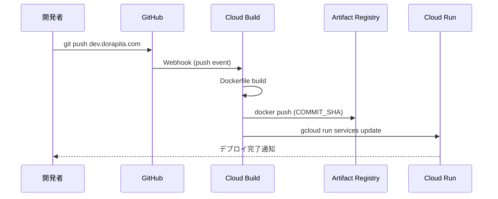
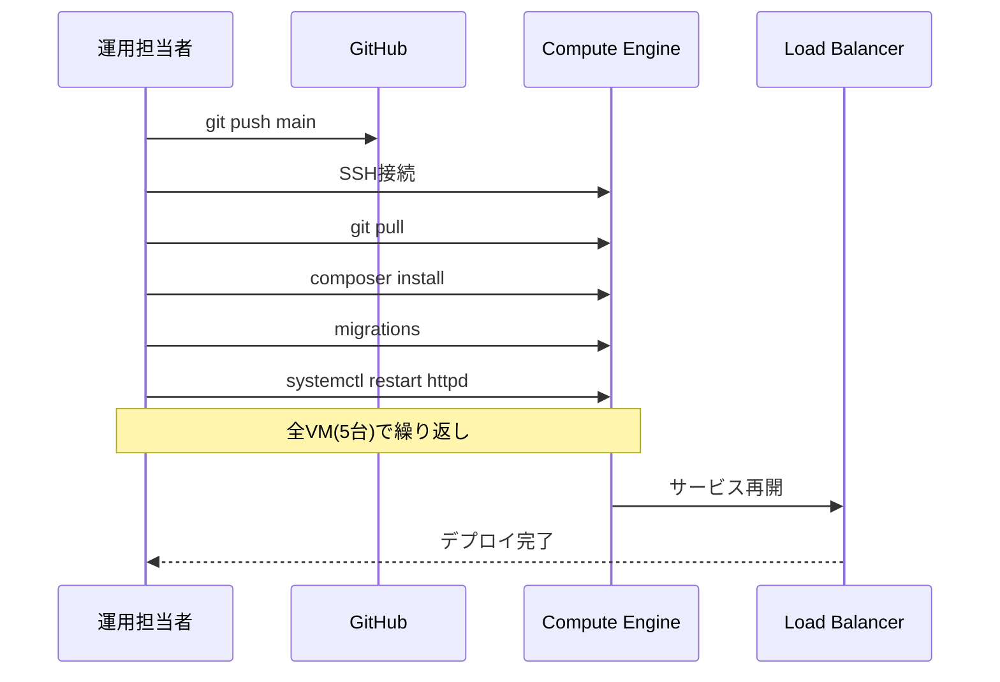

# 開発環境 vs 本番環境 デプロイ方法比較

## 概要

ドラピタプロジェクトでは、**開発環境と本番環境で全く異なるデプロイ方法**を採用しています。

## 環境比較表

| 項目 | 開発環境 (dorapita-core-dev) | 本番環境 (dorapita-core) |
|------|----------------------------|-------------------------|
| **プロジェクトID** | dorapita-core-dev | dorapita-core |
| **インフラ** | Cloud Run中心 | Compute Engine (VM)中心 |
| **Cloud Build Trigger** | ✅ あり（4個） | ❌ なし |
| **自動デプロイ** | ✅ GitHub push → 自動 | ❌ 手動のみ |
| **Cloud Runサービス数** | 7個 | 3個（静的のみ） |
| **VMインスタンス** | 8台（一部停止） | 6台（全稼働） |
| **デプロイ担当者** | 開発者（GitHub push） | matsumoto.t@zigexn.co.jp（手動） |

## 開発環境（dorapita-core-dev）

### デプロイ方式: 自動CI/CD

```
Developer
    ↓ git push origin dev.dorapita.com
GitHub (ZIGExN/dorapita)
    ↓ Webhook
Cloud Build Trigger
    ↓ 自動ビルド
Artifact Registry
    ↓ 自動デプロイ
Cloud Run (asia-northeast1)
```

### Cloud Runサービス

| サービス名 | 自動デプロイ | トリガーブランチ | 最終更新 |
|-----------|-------------|----------------|---------|
| dorapita-com | ✅ | dev.dorapita.com | 自動 |
| cadm-dorapita-com | ✅ | ^dev.cadm.dorapita.com$ | 自動 |
| edit-dorapita-com | ✅ | dev.edit.dorapita.com | 自動 |
| api-dorapita-com | ❓ | 不明 | 手動？ |
| img-dorapita-com | ❌ | - | 手動 |
| help-dorapita-com | ❌ | - | 手動 |
| dorapita-maintenance | ❌ | - | 手動 |

### デプロイ手順

#### 1. 自動デプロイ（dorapita-com, cadm, edit）

```bash
# 開発者の操作
git checkout dev.dorapita.com
git add .
git commit -m "feat: 新機能追加"
git push origin dev.dorapita.com

# ↓ 自動実行（3-5分）

# Cloud Buildが以下を実行:
# 1. Dockerfileからイメージビルド
# 2. Artifact Registryにpush
# 3. Cloud Runサービス更新

# 確認
gcloud run services describe dorapita-com \
  --project=dorapita-core-dev \
  --region=asia-northeast1
```

#### 2. 手動デプロイ（img, help, maintenance）

```bash
# 1. イメージをビルド
gcloud builds submit --tag asia-northeast1-docker.pkg.dev/dorapita-core-dev/homebrew-containers/img-dorapita-com

# 2. Cloud Runにデプロイ
gcloud run deploy img-dorapita-com \
  --image asia-northeast1-docker.pkg.dev/dorapita-core-dev/homebrew-containers/img-dorapita-com \
  --platform managed \
  --region asia-northeast1 \
  --project dorapita-core-dev
```

### Artifact Registry

| リポジトリ | 用途 | サイズ |
|-----------|------|--------|
| cloud-run-source-deploy | 自動デプロイサービス | 53.6 GB |
| api-dorapita-com | API専用 | 2.8 GB |
| homebrew-containers | 手動デプロイサービス | 7.8 GB |

## 本番環境（dorapita-core）

### デプロイ方式: 手動VM更新

```
Developer
    ↓ git push origin main
GitHub (ZIGExN/dorapita)
    ↓ 手動pull
Compute Engine VM (web-*)
    ↓ 手動Apache再起動
本番サービス稼働
```

### Cloud Runサービス

| サービス名 | 用途 | 最終デプロイ | デプロイ者 |
|-----------|------|-------------|----------|
| img-dorapita-com | 画像配信 | 2025-12-09 | matsumoto.t@zigexn.co.jp |
| help-dorapita-com | ヘルプサイト | 2025-08-18 | matsumoto.t@zigexn.co.jp |
| dorapita-maintenance | メンテナンス | 2025-10-08 | matsumoto.t@zigexn.co.jp |

**特徴**:
- ✅ 静的コンテンツのみCloud Run
- ❌ メインアプリ（dorapita-com, cadm）はCloud Run未使用
- ❌ Cloud Build Triggerなし
- ✅ 手動デプロイのみ

### Compute Engine VM

| VM名 | 役割 | スペック | 稼働状況 |
|------|------|---------|---------|
| web-120011 | Webサーバー | n2-standard-2 | RUNNING |
| web-120021 | Webサーバー | n2d-standard-2 | RUNNING |
| web-120022 | Webサーバー | n2d-standard-2 | RUNNING |
| web-120023 | Webサーバー | n2d-standard-2 | RUNNING |
| web-120031 | Webサーバー | t2d-standard-2 | RUNNING |
| gw-120011 | ゲートウェイ | e2-small | RUNNING |

### デプロイ手順

#### 1. VMへの手動デプロイ（メインアプリ）

```bash
# 1. 本番VMにSSH接続
gcloud compute ssh web-120011 \
  --project=dorapita-core \
  --zone=asia-northeast1-a

# 2. ソースコード更新
cd /var/www/dorapita.com
sudo -u apache git pull origin main

# 3. 依存パッケージ更新
sudo -u apache composer install --no-dev --optimize-autoloader

# 4. データベースマイグレーション
sudo -u apache bin/cake migrations migrate

# 5. キャッシュクリア
sudo -u apache bin/cake cache clear_all

# 6. Apacheプロセス再起動
sudo systemctl restart httpd

# 7. 他のVMでも同様の手順を繰り返し
# web-120021, web-120022, web-120023, web-120031
```

#### 2. Cloud Run手動デプロイ（静的コンテンツ）

```bash
# 1. イメージビルド
gcloud builds submit --tag asia-northeast1-docker.pkg.dev/dorapita-core/homebrew-containers/img-dorapita-com

# 2. Cloud Runデプロイ
gcloud run deploy img-dorapita-com \
  --image asia-northeast1-docker.pkg.dev/dorapita-core/homebrew-containers/img-dorapita-com \
  --platform managed \
  --region asia-northeast1 \
  --project dorapita-core
```

### Artifact Registry

| リポジトリ | 用途 | サイズ |
|-----------|------|--------|
| homebrew-containers | Cloud Run (img) | 6.0 GB |

## デプロイフロー詳細比較

### 開発環境: 自動フロー



**所要時間**: 3-5分（自動）

### 本番環境: 手動フロー



**所要時間**: 30分〜1時間（手動、複数VM）

## Cloud Run更新コマンドの違い

### 開発環境（Cloud Build自動実行）

```bash
gcloud run services update dorapita-com \
  --image=asia-northeast1-docker.pkg.dev/dorapita-core-dev/cloud-run-source-deploy/dorapita/dorapita-com:4a6a231ca \
  --platform=managed \
  --region=asia-northeast1 \
  --labels=managed-by=gcp-cloud-build-deploy-cloud-run,commit-sha=4a6a231ca,gcb-build-id=$BUILD_ID \
  --quiet \
  --project=dorapita-core-dev
```

**特徴**:
- ✅ イメージタグ: `COMMIT_SHA`（Git連携）
- ✅ ラベル: `managed-by=gcp-cloud-build-deploy-cloud-run`
- ✅ `--quiet`: 非対話的実行
- ✅ リビジョン自動作成

### 本番環境（手動実行）

```bash
gcloud run deploy img-dorapita-com \
  --image=asia-northeast1-docker.pkg.dev/dorapita-core/homebrew-containers/img-dorapita-com \
  --platform=managed \
  --region=asia-northeast1 \
  --project=dorapita-core
```

**特徴**:
- ❌ イメージタグ: なし（latest相当）
- ❌ 自動ラベルなし
- ✅ 対話的実行（確認プロンプト）
- ⚠️ リビジョン手動管理

## リスクと課題

### 開発環境のリスク

| リスク | 影響 |
|--------|------|
| ✅ 自動デプロイ失敗時の検知遅延 | Cloud Build通知を監視する必要 |
| ✅ 不完全なコードが自動デプロイ | ブランチ保護、PRレビュー必須 |
| ✅ Secret Manager依存 | 権限不足でデプロイ失敗の可能性 |

### 本番環境のリスク

| リスク | 影響 |
|--------|------|
| ❌ 手動デプロイのヒューマンエラー | 設定ミス、手順漏れ |
| ❌ デプロイ所要時間が長い | 30分〜1時間 |
| ❌ 複数VM間の設定ずれ | 各VMで手動実行のため一貫性なし |
| ❌ ロールバックが困難 | git reset + 全VM再デプロイ |
| ❌ デプロイ履歴が不明瞭 | Cloud Buildログなし |

## 推奨改善策

### 短期（3ヶ月）

1. **本番環境にCloud Build Trigger追加**
   - ブランチ: `main`
   - 手動承認ステップ追加

2. **ステージング環境導入**
   - 本番相当の環境でテスト
   - Cloud Run + VM混在構成

3. **自動テスト追加**
   - PHPUnit, コードカバレッジ
   - ビルド前に実行

### 中期（6ヶ月）

1. **本番VMのCloud Run化**
   - dorapita-com, cadm-dorapita-com
   - Blue-Greenデプロイ

2. **カナリアデプロイ導入**
   - トラフィック段階的移行
   - 10% → 50% → 100%

3. **モニタリング強化**
   - Cloud Monitoring統合
   - エラー率、レイテンシ監視

### 長期（1年）

1. **完全GitOps化**
   - Kubernetes (GKE) 移行検討
   - ArgoCD/Flux導入

2. **マルチリージョン展開**
   - asia-northeast1 + us-central1
   - グローバルロードバランサー

## まとめ

| 項目 | 開発環境 | 本番環境 |
|------|---------|---------|
| **デプロイ方式** | 自動（Cloud Build） | 手動（SSH + git pull） |
| **所要時間** | 3-5分 | 30-60分 |
| **インフラ** | Cloud Run | Compute Engine VM |
| **リスク** | 自動化のバグ影響 | 手動オペミス |
| **スケーラビリティ** | ✅ 自動スケール | ❌ 手動VM追加 |
| **ロールバック** | ✅ 1コマンド | ❌ 複雑（全VM） |
| **コスト** | 💰 変動（リクエスト従量） | 💰💰 固定（VM常時稼働） |

**結論**: 開発環境は最新のCloud Nativeアーキテクチャを採用しているが、本番環境は旧来のVM管理方式。本番環境の近代化が課題。

## 関連ドキュメント

- [CI/CDパイプライン](CI_CD_PIPELINE.md)
- [Cloud Build Trigger詳細](CLOUD_BUILD_TRIGGER_MECHANISM.md)
- [ローカル開発環境](LOCAL_DEVELOPMENT.md)
- [GCPインフラ比較](../gcp_inventory_reports/dorapita-inventory.md)
