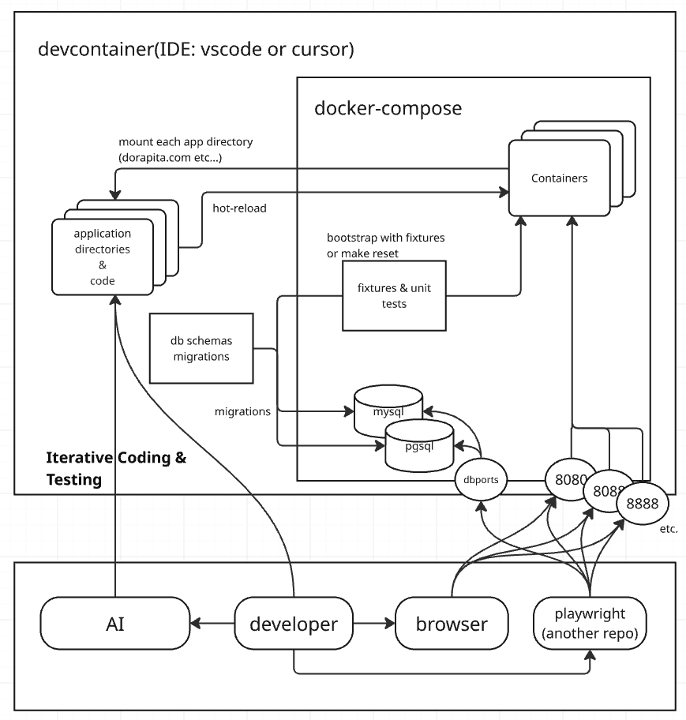
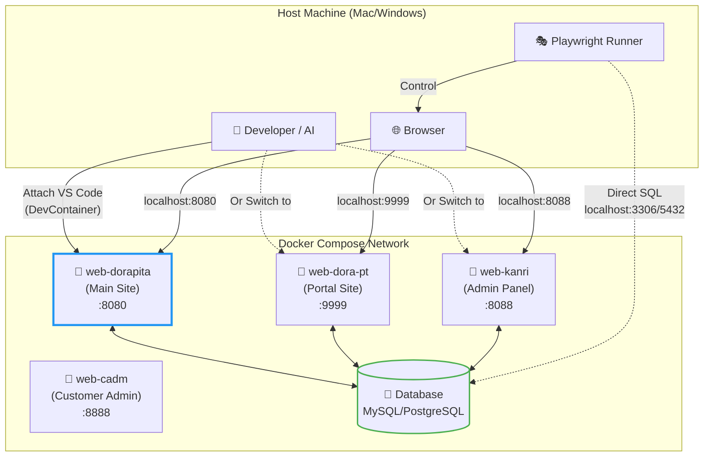
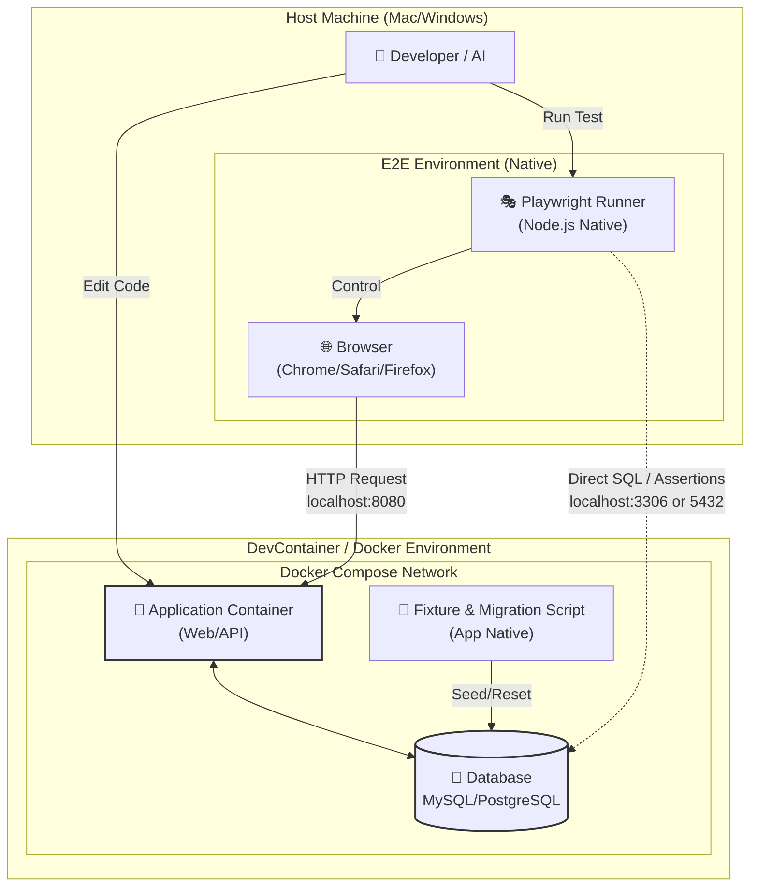
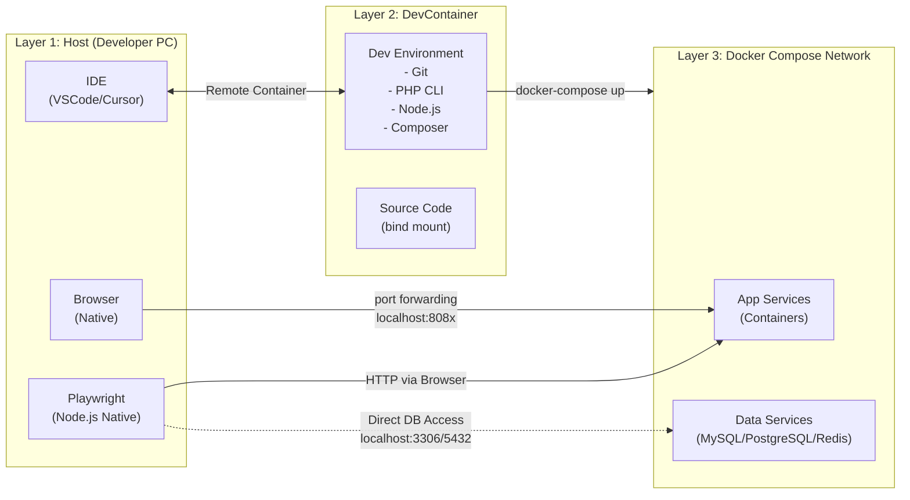
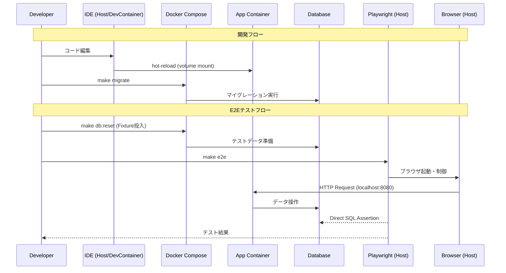
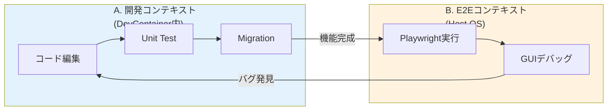
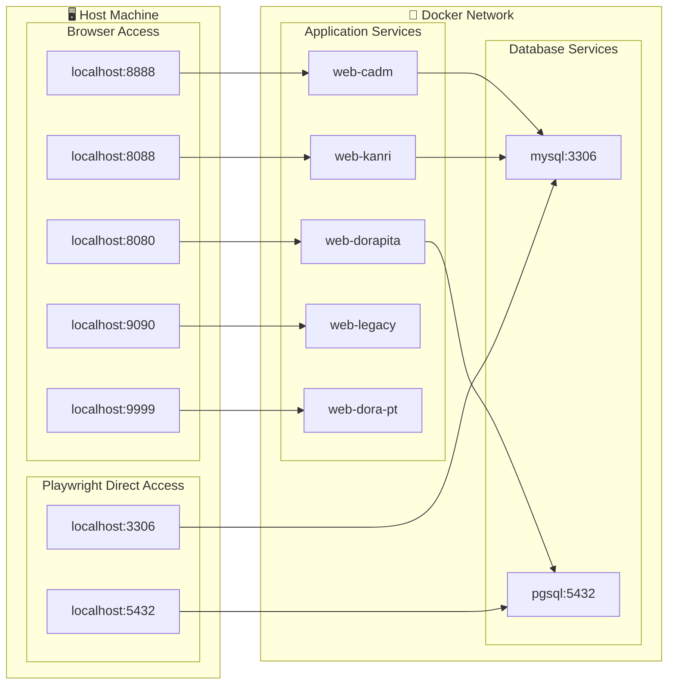
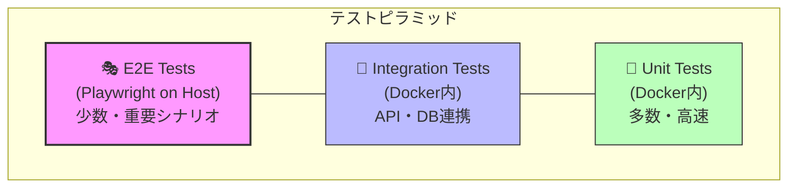
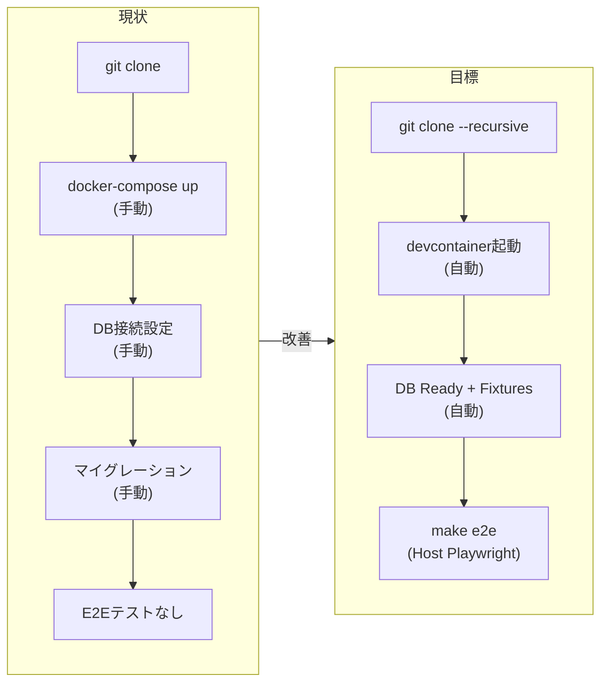
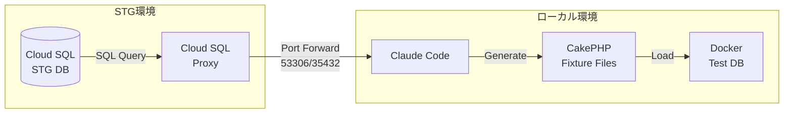

# ローカル開発環境アーキテクチャ設計

## 概要

Dorapitaのローカル開発環境は、**開発体験（DX）とパフォーマンスを最大化**するため、以下のハイブリッド構成を採用する：

- **アプリケーション**: Docker (DevContainer) 内で動作
- **E2Eテスト (Playwright)**: ホストマシン上でネイティブ動作
- **マルチサービス構成**: VS Code「Multiple DevContainer Definitions」で**一度に一つのサービス**を選択してアタッチ

このプロジェクトは、単一のWebコンテナではなく、**複数の独立したサービス**（`web-dorapita`, `web-dora-pt`, `web-kanri` 等）で構成されている。開発者はサービスを切り替えながら作業する。

---

## アーキテクチャ図

### 全体構成図（設計イメージ）



*上図は目標とするローカル開発環境のアーキテクチャ設計図*

---

### マルチサービスDevContainer構成図



**ポイント**: VS Codeは一度に**1つのサービスのみ**にアタッチ。他サービスへのアクセスはDockerサービス名（例: `http://web-dora-pt:80`）を使用。

---

### 全体構成図（ハイブリッドE2E構成 - Mermaid）



### レイヤー別詳細図



### データフロー図



---

## Key Architecture Decisions

この構成における重要な決定事項は以下の通り。

### 1. Execution Context Separation（実行環境の分離）

| コンポーネント | 実行場所 | 理由 |
|---------------|---------|------|
| **Application** | Docker Container | Linux環境、依存関係の完全なカプセル化 |
| **E2E (Playwright)** | Host OS | ブラウザ描画の高速化、ネイティブパフォーマンス、GUIデバッグの容易性 |

### 2. Network Strategy（ネットワーク戦略）

| アクセス種別 | 経路 | 用途 |
|-------------|------|------|
| **Web Access** | `localhost:8080` 等 | HostのブラウザからDocker内のWebアプリへアクセス |
| **DB Access** | `localhost:5432/3306` | HostのPlaywrightからDocker内のDBへ**直接接続** |

これにより、PlaywrightはHTTP経由の操作だけでなく、**DBの直接検証**も可能になる。

### 3. Fixture & Data Strategy（データ管理戦略）

| 項目 | 方針 |
|-----|------|
| **Fixture Source** | データ生成ロジック（Fixtures）は、**Docker側のアプリケーションリポジトリにあるもの**を正とする |
| **Execution** | データの初期化・リセットは、Docker内のコマンド（`make reset` や `npm run db:seed` 等）によって行う |
| **Playwright Role** | Playwright側で独自のFixtureデータ定義は（現時点では）持たない。Docker側で投入されたデータの構造を「知っている」前提でテストシナリオを実行 |

---

## 開発ワークフロー & コンテキスト

**重要**: AIは、現在のセッションが「どのコンテキスト」にあるかを常に意識してコマンドやコードを提案する必要がある。

### A. アプリケーション開発コンテキスト（DevContainer内）

| 項目 | 説明 |
|-----|------|
| **状態** | VS Codeは `.devcontainer/<service-name>/devcontainer.json` で定義された、**特定の1つのサービス**（例: `web-dorapita`）にアタッチ |
| **ファイルパス** | ワークスペースのルートは、そのサービスのソースコード（例: `/var/www/dorapita.com`）として扱われる |
| **他サービスへのアクセス** | 別のコンテナ（例: `web-dora-pt`）のAPIを叩く場合は、Dockerサービス名を使用（例: `http://web-dora-pt:80`） |
| **主な操作** | ユニットテスト実行、パッケージインストール（`composer`, `npm`）、DBマイグレーション |

```bash
# DevContainer内での操作例
composer install
bin/cake migrations migrate
vendor/bin/phpunit tests/TestCase/Controller/

# 他サービスへのアクセス（Docker内部ネットワーク）
curl http://web-dora-pt:80/api/health
```

### B. E2Eテストコンテキスト（Host OS）

| 項目 | 説明 |
|-----|------|
| **状態** | Dockerの外側（ホストマシン）のターミナル |
| **主な操作** | Playwrightの実行、GUIデバッグ |
| **ネットワーク** | すべてのWebサービスとDBに対して、`localhost`のポートフォワード経由でアクセス |

```bash
# Host OSでの操作例
cd dorapita_playwright
npx playwright test
npx playwright test --ui  # GUIデバッグ

# localhostでアクセス
curl http://localhost:8080      # web-dorapita
curl http://localhost:9999      # web-dora-pt
mysql -h localhost -P 3306 -u root
```

### コンテキスト切り替えフロー



---

## .devcontainer ディレクトリ構造

```
dorapita_code/
├── .devcontainer/
│   ├── web-dorapita/
│   │   └── devcontainer.json    # dorapita.com用
│   ├── web-dora-pt/
│   │   └── devcontainer.json    # dora-pt.jp用
│   ├── web-kanri/
│   │   └── devcontainer.json    # kanri.dorapita.com用
│   ├── web-cadm/
│   │   └── devcontainer.json    # cadm.dorapita.com用
│   └── web-legacy/
│       └── devcontainer.json    # legacy.dorapita.com用
├── docker-compose.yml
├── dorapita.com/
├── dora-pt.jp/
├── kanri.dorapita.com/
├── cadm.dorapita.com/
└── legacy.dorapita.com/
```

### devcontainer.json 例（web-dorapita）

```json
{
  "name": "Dorapita Main Site",
  "dockerComposeFile": ["../../docker-compose.yml"],
  "service": "web-dorapita",
  "workspaceFolder": "/var/www/dorapita.com",
  "shutdownAction": "none",
  "customizations": {
    "vscode": {
      "extensions": [
        "bmewburn.vscode-intelephense-client",
        "ms-azuretools.vscode-docker"
      ]
    }
  }
}
```

### サービス切り替え方法

1. **VS Code**: `F1` → `Dev Containers: Reopen in Container` → サービス選択
2. **VS Code**: 左下の「><」アイコン → `Reopen in Container`
3. **コマンドライン**: `devcontainer open --workspace-folder . --config .devcontainer/web-dorapita/devcontainer.json`

---

## Implementation Requirements

### Port Forwarding（必須）

`docker-compose.yml` において、**Appポートだけでなく、DBポートも必ずHost側にExposeする**。

```yaml
services:
  mysql:
    ports:
      - "3306:3306"  # Host:Container

  pgsql:
    ports:
      - "5432:5432"  # Host:Container

  web-dorapita:
    ports:
      - "8080:80"
```

### Environment Variables（環境変数）

| 環境 | DB Host設定 | 理由 |
|-----|------------|------|
| **Playwright (Host)** | `localhost` | Hostから直接DBにアクセス |
| **App (Docker)** | `db` (サービス名) | Docker内部ネットワーク経由 |

```bash
# Host用 .env.test (Playwright)
DB_HOST=localhost
DB_PORT=3306

# Docker用 .env (App)
DB_HOST=db
DB_PORT=3306
```

### Test Isolation（テスト分離）

テスト実行前に、Docker側のFixtureコマンドを実行してDB状態を確定させる。

```typescript
// playwright.config.ts の globalSetup
export default async () => {
  // Docker側でFixture投入
  execSync('docker-compose exec app make db:reset');
};
```

---

## コンポーネント詳細

### 1. Host Machine

| コンポーネント | 役割 |
|---------------|------|
| IDE | VSCode/Cursor + Remote Containers拡張 |
| Browser | Chrome/Safari/Firefox（Playwright制御下） |
| Playwright | E2Eテストランナー（Node.js native） |
| Node.js | Playwright実行環境 |

### 2. DevContainer（現状: 未実装）

| コンポーネント | 役割 |
|---------------|------|
| application directories & code | ホストからbind mountされたソースコード |
| db schemas migrations | CakePHP Phinxマイグレーション・シーダー |

**⚠️ 現状**: `devcontainer.json` は存在しない。ホストから直接 `docker-compose up` している模様。

### 3. Docker Compose Services

#### Application Containers

| サービス名 | ポート | 用途 | DB依存 |
|-----------|-------|------|--------|
| web-dorapita | 8080 | メインサイト (dorapita.com) | PostgreSQL + Redis |
| web-dora-pt | 9999 | dora-pt.jp | MySQL |
| web-legacy | 9090 | 旧システム (legacy.dorapita.com) | MySQL |
| web-cadm | 8888 | 顧客管理画面 (cadm.dorapita.com) | MySQL |
| web-kanri | 8088 | 管理画面 (kanri.dorapita.com) | MySQL |
| web-sorry | 11111 | メンテナンスページ | - |

#### Database Layer

| サービス | バージョン | Host Port | 用途 |
|---------|----------|-----------|------|
| mysql | 5.7 | **3306** | レガシー・管理系 |
| pgsql | 10-alpine | **5432** | メインサイト |
| redis | 7.2-alpine | 6379 | キャッシュ・セッション |

**重要**: DBポートは**Hostに公開する**（Playwrightからの直接アクセス用）

#### Support Services

| サービス | ポート | 用途 |
|---------|-------|------|
| mailhog | 1025/8025 | メール送信テスト |

---

## ポートマッピング

### 全体図



### ポート一覧

| ポート | サービス | Host公開 | 用途 |
|-------|---------|---------|------|
| 8080 | web-dorapita | ✅ | メインサイト |
| 8088 | web-kanri | ✅ | 管理画面 |
| 8888 | web-cadm | ✅ | 顧客管理画面 |
| 9090 | web-legacy | ✅ | 旧システム |
| 9999 | web-dora-pt | ✅ | dora-pt.jp |
| **3306** | mysql | ✅ **必須** | **Playwright DB検証用** |
| **5432** | pgsql | ✅ **必須** | **Playwright DB検証用** |
| 6379 | redis | ✅ | キャッシュ |
| 1025 | mailhog | ✅ | SMTP |
| 8025 | mailhog | ✅ | Web UI |

---

## テスト戦略

### テストピラミッド



### 実行環境マトリクス

| テスト種別 | 実行場所 | 理由 | コマンド |
|-----------|---------|------|---------|
| Unit Tests | Docker内 | アプリ依存関係が必要 | `make test-unit` |
| Integration Tests | Docker内 | DB接続が必要 | `make test-integration` |
| **E2E Tests** | **Host** | ブラウザ性能・デバッグ | `make e2e` |

### Playwrightの役割

```typescript
// E2Eテストの典型的なフロー
test('求人に応募できる', async ({ page }) => {
  // 1. Fixture確認（Docker側で投入済み）
  // テストユーザー: test@example.com / password123

  // 2. ブラウザ操作（HTTP経由）
  await page.goto('http://localhost:8080/login');
  await page.fill('#email', 'test@example.com');
  await page.fill('#password', 'password123');
  await page.click('button[type="submit"]');

  // 3. 求人応募
  await page.goto('http://localhost:8080/jobs/1');
  await page.click('text=応募する');

  // 4. DB直接検証（Host → Docker DB）
  const { rows } = await db.query(
    'SELECT * FROM entries WHERE user_id = 1 ORDER BY id DESC LIMIT 1'
  );
  expect(rows[0].job_id).toBe(1);
});
```

---

## 改善設計の方向性

### 現状 vs 目標状態



### Phase 1: DevContainer + DB Port Expose

```yaml
# docker-compose.yml の変更点
services:
  mysql:
    ports:
      - "3306:3306"  # ← Host公開を追加

  pgsql:
    ports:
      - "5432:5432"  # ← Host公開を追加
```

### Phase 2: Playwright環境構築（Host側）

```bash
# Host側でPlaywrightセットアップ
cd e2e/
npm init playwright@latest
npm install

# 環境変数設定
cp .env.example .env.test
# DB_HOST=localhost
# DB_PORT=3306
```

### Phase 3: Fixture連携

```makefile
# Makefile
.PHONY: e2e

e2e:
	# 1. Docker側でDB初期化
	docker-compose exec app make db:reset
	# 2. Host側でPlaywright実行
	cd e2e && npx playwright test
```

---

## 具体的な成果物

### Phase 1 成果物

| 成果物 | 説明 |
|-------|------|
| `.devcontainer/devcontainer.json` | VSCode/Cursor用設定 |
| `.devcontainer/Dockerfile` | 開発コンテナイメージ |
| `docker-compose.yml` (修正) | DB Port Expose追加 |
| `Makefile` | 共通コマンド定義 |

### Phase 2 成果物

| 成果物 | 説明 |
|-------|------|
| `e2e/package.json` | Playwright依存関係 |
| `e2e/playwright.config.ts` | Playwright設定 |
| `e2e/.env.test` | Host用環境変数 |
| `e2e/tests/*.spec.ts` | E2Eテストコード |

### Phase 3 成果物

| 成果物 | 説明 |
|-------|------|
| `*/tests/Fixture/*.php` | 各アプリのFixture |
| `e2e/global-setup.ts` | Fixture実行フック |
| `docs/testing/e2e-guide.md` | E2Eテストガイド |

---

## Playwright設計パターン（dorapita_playwright準拠）

### ディレクトリ構造

```
dorapita_playwright/
├── tests/
│   ├── e2e/                    # E2Eテストファイル
│   │   ├── application/        # 応募フロー
│   │   ├── login/              # ログインテスト
│   │   ├── profile/            # プロフィールテスト
│   │   └── recruit/            # 求人関連テスト
│   ├── constants/              # 定数定義
│   │   ├── index.ts
│   │   ├── urls.ts
│   │   └── form-data.ts
│   ├── fixtures/               # Playwright Test Fixtures
│   │   ├── profile.ts          # 認証済みコンテキスト
│   │   └── recruit.ts          # 動的recruitId取得
│   ├── helpers/                # テストヘルパー
│   │   └── auth.ts             # 認証ヘルパー
│   └── pages/                  # Page Object Model
│       ├── profile.ts
│       └── ...
├── playwright.config.ts
├── tsconfig.json               # Path Alias設定
├── .env.example
├── .env.stg
└── .env.prod
```

### Page Object Model (POM)

```typescript
// tests/pages/profile.ts
export class ProfilePage {
    constructor(private page: Page) {}

    async navigateToProfile() {
        await this.page.goto(URLS.profile);
    }

    async editField(selector: string, value: string) {
        await this.page.fill(selector, value);
    }
}
```

### Playwright Test Fixtures

```typescript
// tests/fixtures/profile.ts - 認証済みコンテキスト
export const test = base.extend<{
    authenticatedPage: Page;
    profilePage: ProfilePage;
}>({
    authenticatedPage: async ({ page }, use) => {
        await AuthHelper.loginToApplication(page);
        await use(page);
    },
    profilePage: async ({ page }, use) => {
        await AuthHelper.loginToApplication(page);
        const profilePage = new ProfilePage(page);
        await profilePage.navigateToProfile();
        await use(profilePage);
    },
});
```

### Path Alias設定

```json
// tsconfig.json
{
  "compilerOptions": {
    "paths": {
      "@/*": ["./tests/*"]
    }
  }
}
```

---

## 環境別実行戦略

### 環境変数管理

| ファイル | 用途 | BASE_URL例 |
|----------|------|-----------|
| `.env` | ローカル開発 | `http://localhost:8080` |
| `.env.stg` | STG環境テスト | `https://stg.dorapita.com` |
| `.env.prod` | 本番（readonly） | `https://dorapita.com` |

### テストユーザー管理

```bash
# .env.example
TEST_USER_ID=12345
TEST_USER_EMAIL=test@example.com
TEST_USER_PASSWORD=TestPassword123!

# セキュリティテスト用
XSS_TEST_INPUT=<script>alert('XSS')</script>
SQL_INJECTION_INPUT=' OR '1'='1
```

### 実行コマンド

```bash
# ローカル環境（Docker）
npx playwright test

# STG環境
npx playwright test --config=playwright.stg.config.ts

# 本番環境（readonlyテストのみ）
npx playwright test tests/e2e/readonly/ --config=playwright.prod.config.ts
```

---

## Fixture戦略: STG DBからの生成

### 現状の問題

**重要**: `dorapita_code`の各アプリに**CakePHP Fixtureが存在しない**。

```
dorapita.com/tests/Fixture/      → 空（vendor/のみ）
cadm.dorapita.com/tests/Fixture/ → 空（vendor/のみ）
```

### 解決策: STG DBからFixture生成

#### 1. Cloud SQL Proxy経由でSTG DB接続

```bash
# docker-compose.ymlのcloud-sql-proxyサービスを使用
# または手動でcloud-sql-proxy起動

# MySQL (STG)
cloud-sql-proxy dorapita-core-dev:asia-northeast1:dorapita-core-dev-db \
  --port=53306 --gcloud-auth

# PostgreSQL (STG)
cloud-sql-proxy dorapita-core-dev:asia-northeast1:dorapita-core-dev-pgsql \
  --port=35432 --gcloud-auth
```

#### 2. STG DB接続情報

| DB | Port | User | Password | Database |
|----|------|------|----------|----------|
| MySQL | 53306 | root | ※.secret参照 | dorapita1804 |
| PostgreSQL | 35432 | dorauser2022 | ※.secret参照 | dorapita |

#### 3. Claude Codeによるサンプルデータ抽出

```sql
-- ユーザーFixture用
SELECT id, email, name, password_hash, created_at
FROM users
WHERE is_test_user = true OR id IN (/* テスト用ID */)
LIMIT 10;

-- 求人Fixture用
SELECT id, title, company_id, status, created_at
FROM recruits
WHERE status = 'active'
LIMIT 20;
```

#### 4. CakePHP Fixture生成

```php
// dorapita.com/tests/Fixture/UsersFixture.php
<?php
declare(strict_types=1);

namespace App\Test\Fixture;

use Cake\TestSuite\Fixture\TestFixture;

class UsersFixture extends TestFixture
{
    public function init(): void
    {
        $this->records = [
            [
                'id' => 1,
                'email' => 'test@example.com',
                'name' => 'Test User',
                'password_hash' => '$2y$10$...',  // bcrypt hash
                'created_at' => '2024-01-01 00:00:00',
            ],
            // ... Claude Codeが生成
        ];
        parent::init();
    }
}
```

### Fixture生成ワークフロー



### Fixture生成時の考慮事項

| 項目 | 方針 |
|-----|------|
| **個人情報** | マスキングまたはダミーデータに置換 |
| **パスワード** | テスト用固定ハッシュに置換 |
| **外部キー** | 参照整合性を維持（依存テーブルも同時生成）|
| **日時** | 相対日時または固定日時に正規化 |
| **ID** | 連番で再採番（AUTO_INCREMENT競合回避）|

### 優先度順Fixture作成リスト

| 優先度 | テーブル | 理由 |
|--------|---------|------|
| **最高** | users | 認証テストの基盤 |
| **最高** | companies | 求人・企業管理の基盤 |
| **高** | recruits | 求人検索・応募テスト |
| **高** | entries | 応募フロー検証 |
| **中** | profiles | プロフィール編集テスト |
| **中** | areas, job_categories | マスターデータ |

---

## 実装フェーズ

### フェーズ概要

| Phase | 名称 | 目標 | 状態 | 詳細計画 |
|-------|------|------|------|----------|
| **1** | Docker Compose起動確認 | 全アプリが起動する状態 | ✅ 完了 | [how-to-up-docker-compose.md](./how-to-up-docker-compose.md) |
| **2** | Fixture整備 | STG DBからサンプルデータ抽出 | 🟡 次の作業 | 本ドキュメント参照 |
| **3** | Fixture投入の仕組み化 | make db:seed で投入可能に | 🔴 未着手 | Phase 2と統合予定 |
| **4** | DevContainer設定 | VS Codeでコンテナにアタッチ | 🔴 未着手 | [phase1-devcontainer-setup.md](./phase1-devcontainer-setup.md) |
| **5** | Unit Test整備 | PHPUnitが動作する状態 | 🔴 未着手 | Phase 4完了後に作成 |
| **6** | Migration/E2E | 残りの開発基盤整備 | 🔴 未着手 | Phase 5完了後に再整理 |

**計画変更の理由**:
- Docker Compose起動は既に完了（Phase 1の本来の目標を達成）
- データがないとアプリケーションの動作確認・テストができない
- STG DB接続方法（cloud-sql-proxy）は既に確立済み
- DevContainerはFixture整備後でも問題なく進められる

### Phase 1: Docker Compose起動確認 ✅ 完了

**目標**: 全アプリケーションがDocker Composeで起動する状態

**完了した成果物**:
- [x] `dorapita.com/config/schema/init.sql`（PostgreSQLスキーマ）
- [x] `dorapita.com/config/schema/mysql-init.sql`（MySQLスキーマ）
- [x] `dorapita.com/config/.env`（ローカル用）
- [x] `cadm.dorapita.com/config/.env`（ローカル用）
- [x] `kanri.dorapita.com/config/.env`（ローカル用）

**検証済み**:
- [x] dorapita.com (8080): HTTP 200 ✅
- [x] dora-pt.jp (9999): HTTP 200 ✅
- [x] cadm.dorapita.com (8888): HTTP 302→200（ログイン画面）✅
- [x] kanri.dorapita.com (8088): HTTP 302→200（ログイン画面）✅

→ 詳細: [how-to-up-docker-compose.md](./how-to-up-docker-compose.md)

### Phase 2: Fixture整備 🟡 次の作業

**目標**: STG DBからテストに必要なサンプルデータを抽出し、Fixtureファイルを作成

**成果物**:
- [ ] STG PostgreSQL接続確認（cloud-sql-proxy pg-120011）
- [ ] 主要テーブルのデータ抽出（users, companies, recruits等）
- [ ] `dorapita.com/tests/Fixture/UsersFixture.php`
- [ ] `dorapita.com/tests/Fixture/CompaniesFixture.php`
- [ ] `dorapita.com/tests/Fixture/RecruitsFixture.php`
- [ ] 個人情報マスキング・ダミーデータ置換

**STG DB接続情報**:
| DB | Instance | Port | User | Password | Database |
|----|----------|------|------|----------|----------|
| PostgreSQL | pg-120011 | 35432 | dorauser2022 | ※.secret参照 | dorapita |
| MySQL | db-120011 | 33306 | root | ※.secret参照 | dorapita1804_db |

### Phase 3: Fixture投入の仕組み化

**目標**: `make db:seed` または `bin/cake migrations seed` でFixtureを投入可能にする

**成果物**:
- [ ] CakePHP Seederの作成
- [ ] Makefile または composer scriptの整備
- [ ] Fixture投入手順のドキュメント化

**注**: Phase 2と統合して進める可能性あり

### Phase 4: DevContainer設定

**目標**: VS Code DevContainerでdorapita_codeを起動し、コード修正ができる状態にする

**成果物**:
- [ ] `.devcontainer/web-dorapita/devcontainer.json`
- [ ] `.devcontainer/web-cadm/devcontainer.json`
- [ ] `.devcontainer/web-kanri/devcontainer.json`
- [ ] `.devcontainer/web-dora-pt/devcontainer.json`

**検証基準**:
- [ ] VS Codeでコンテナにアタッチできる
- [ ] `php -v` / `composer --version` が動作
- [ ] `bin/cake migrations status` でDB接続成功
- [ ] ソースコード編集が反映される

→ 詳細: [phase1-devcontainer-setup.md](./phase1-devcontainer-setup.md)

### Phase 5: Unit Test整備

**目標**: PHPUnitが正常に動作し、Fixtureを使ったテストが実行できる状態

**成果物**:
- [ ] `composer test` が実行可能
- [ ] Fixture投入確認用の最小テストケース
- [ ] テスト実行ガイドライン

### Phase 6: Migration/E2E（Phase 5完了後に再整理）

**想定内容**:
- マイグレーション運用整備
- Playwright E2E環境構築
- CI/CD統合
- テストレポート自動化

---

## 完了済みタスク

### Phase 1: Docker Compose起動確認（完了）

- [x] 現行の `docker-compose.yml` の詳細分析
- [x] DBポート公開確認（既に公開済み: MySQL 3306, PostgreSQL 5432）
- [x] STG PostgreSQLスキーマ抽出（init.sql: 20テーブル）
- [x] STG MySQLスキーマ抽出（mysql-init.sql: 159テーブル/ビュー）
- [x] PostgreSQLスキーマ適用（ローカル）
- [x] MySQLスキーマ適用（ローカル）
- [x] 全アプリケーション起動確認
  - [x] dorapita.com (8080): HTTP 200 ✅
  - [x] dora-pt.jp (9999): HTTP 200 ✅
  - [x] cadm.dorapita.com (8888): HTTP 302→200 ✅
  - [x] kanri.dorapita.com (8088): HTTP 302→200 ✅
- [x] .env設定（dorapita.com, cadm, kanri）

### 設計・分析

- [x] ハイブリッドE2Eアーキテクチャ設計
- [x] dorapita_playwright分析・ギャップ特定
- [x] マルチサービスDevContainer構成設計

### ドキュメント

- [x] local-development-architecture.md 作成
- [x] phase1-devcontainer-setup.md 作成
- [x] how-to-up-docker-compose.md 作成・更新

---

## 参照ドキュメント

- **dorapita_playwright**: `../dorapita_playwright/` (submodule)
- **dorapita_code**: `../dorapita_code/` (submodule)
- **テスト規約**: `../dorapita_code/.claude/rules/05-testing.md`
- **DB運用**: `../dorapita_code/.claude/rules/07-database.md`

---

*このドキュメントは開発環境改善設計の基礎資料として作成。Geminiとの壁打ちを経てハイブリッドE2Eアーキテクチャを採用。dorapita_playwrightとの比較分析に基づきFixture戦略を追記。マルチサービスDevContainer構成（Multiple DevContainer Definitions）を追加。*

*最終更新: 2025-12-26（実行計画を変更: Fixture整備優先に）*
