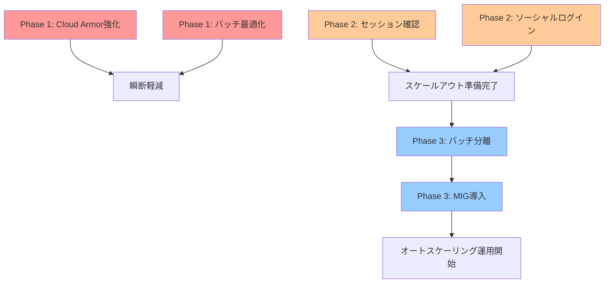

# BOTアクセス過多・瞬断問題とオートスケーリング導入検討レポート

**作成日**: 2025-12-26
**ステータス**: 検討中
**優先度**: 高

---

## エグゼクティブサマリー

BOTなどのアクセス過多によるサービス瞬断が発生している。オートスケーリングによる負荷分散を検討するにあたり、**現状のアーキテクチャには3つの根本的な課題**があり、これらを解決しないままスケールアウトしても効果は限定的。

| 課題 | 影響 | 対応優先度 |
|------|------|-----------|
| セッション管理がサーバーローカル | スケールアウト時にセッション不整合 | **最優先** |
| バッチ処理がWebサーバーと同居 | バッチ負荷がWeb応答に影響 | **高** |
| 固定台数VM構成 | 急激な負荷増に対応不可 | 中 |

---

## 1. 現状の問題

### 1.1 瞬断の発生状況

過去のissue分析により、瞬断は**複合的な要因**で発生している：

| Issue | 問題 | 状態 | 根本原因 |
|-------|------|------|----------|
| #3977 | MySQL→PostgreSQL同期バッチで瞬断（エラー率最大80%） | open | N+1問題、バッチ負荷スパイク |
| #3725 | スケールアップ後も瞬断継続 | open | botトラフィック、高負荷クエリ |
| #2931 | view_logsバッチによる瞬断 | closed | 索引なし全件スキャン、1分周期実行 |

### 1.2 現在のインフラ構成

```
┌─────────────────────────────────────────────────────────────┐
│              Cloud Load Balancer + Cloud Armor               │
│                    (WAF設定あり、BOT対策は限定的)              │
└────────────────────────────┬────────────────────────────────┘
                             │
              ┌──────────────┴──────────────┐
              │                             │
              ▼                             ▼
┌─────────────────────────┐    ┌─────────────────────────┐
│     Compute Engine      │    │       Cloud Run         │
│      (固定5台)           │    │    (自動スケール)        │
│                         │    │                         │
│ - web-120011            │    │ - help-dorapita-com     │
│ - web-120021            │    │ - img-dorapita-com      │
│ - web-120022            │    │ - dorapita-maintenance  │
│ - web-120023            │    │                         │
│ - web-120031            │    │ ※本番はこの3つのみ        │
└────────────┬────────────┘    └─────────────────────────┘
             │
             │  ★問題: バッチ処理もここで実行
             │
             ▼
┌─────────────────────────────────────────────────────────────┐
│                        Cloud SQL                             │
│  - db-120011 (MySQL 5.7) ← EOL済み                           │
│  - pg-120011 (PostgreSQL 10) ← EOL済み                       │
│  ★問題: SSL未強制、スケールアップしても瞬断継続               │
└────────────────────────────────────────────────────────────┘
             │
             ▼
┌─────────────────────────────────────────────────────────────┐
│                      Memorystore Redis                       │
│  - redis-120011 (1GB)                                        │
│  ★セッション管理に使用中（#2291で導入済み）                    │
└─────────────────────────────────────────────────────────────┘
```

### 1.3 問題の構造

```
[BOT/クローラ急増]
       │
       ▼
[Webサーバー負荷増]  ←───── [バッチ処理も同時実行]
       │                           │
       ▼                           ▼
[Cloud SQL CPU高騰] ◀─────── [N+1クエリ、全件スキャン]
       │
       ▼
[Readiness Probe失敗]
       │
       ▼
[サービス瞬断（1-3分）]
```

---

## 2. オートスケーリング導入の前提条件

現状のまま単純にサーバーを増やしても、以下の問題が発生する：

### 2.1 セッション管理の課題

| 項目 | 現状 | 問題 |
|------|------|------|
| セッションストレージ | Redis（#2291で導入済み） | ✅ 共有化済み |
| セッションスティッキー | 不明 | 要確認 |
| ログイン状態 | Cookie + Redis併用 | 要確認 |

**#2291の実装内容**:
- Redis導入済み（app_session_, cadm_session_ 等のprefix分離）
- 有効期限30分（アクティビティで延長）
- Remember Me Cookie（1-7日）との併用

→ **セッション共有は既に対応済み**の可能性あり。ソーシャルログイン改修（#3516）と合わせて最終確認が必要。

### 2.2 バッチ処理の課題

| バッチ | 問題 | 影響度 |
|--------|------|--------|
| MySQL→PostgreSQL同期 | N+1問題、複数件更新時にエラー率80% | **高** |
| view_logs同期 | 索引なし全件スキャン、1分周期 | **高** |
| メール送信バッチ | 処理されない問題発生中（#3838） | 中 |

**根本原因**: バッチ処理がWebサーバーと同居しており、バッチ負荷がWeb応答に直接影響。

### 2.3 データベースの課題

| 項目 | 現状 | リスク |
|------|------|--------|
| MySQL | 5.7（EOL: 2023年10月） | セキュリティパッチなし |
| PostgreSQL | 10（EOL: 2022年11月） | セキュリティパッチなし |
| SSL | 未強制 | 平文通信の可能性 |
| 統合計画 | PostgreSQL→MySQL移行検討中 | 同期バッチが負債化 |

---

## 3. 推奨アクションプラン

ユーザー提案の3つの施策を軸に、段階的に実施する。

### Phase 1: 即時対応（1-2週間）

#### 1.1 Cloud Armor強化（BOT対策）

```bash
# Rate Limiting ルール追加
gcloud compute security-policies rules create 1000 \
  --security-policy=allow-dorapita-system \
  --expression="request.headers['user-agent'].contains('bot')" \
  --action=throttle \
  --rate-limit-threshold-count=100 \
  --rate-limit-threshold-interval-sec=60 \
  --conform-action=allow \
  --exceed-action=deny-429

# reCAPTCHA Enterprise連携
gcloud recaptcha keys create \
  --display-name="dorapita-bot-protection" \
  --integration-type=SCORE \
  --web
```

**期待効果**: 悪意あるBOTアクセスを即座にブロックし、サーバー負荷を軽減。

#### 1.2 同期バッチの緊急最適化（#3977対応）

```sql
-- N+1解消: バルクインサート/アップデートへ変更
-- Before: ループ内でfind() + save()
-- After: 一括取得 + バルク更新
```

**期待効果**: バッチ実行時のDB負荷を大幅軽減。

---

### Phase 2: 短期対応（1ヶ月）

#### 2.1 セッション共有化の確認・強化

**現状確認項目**:
1. Redis導入（#2291）の実装範囲を確認
2. 全サービス（dorapita.com, cadm, edit, kanri）でRedisセッションが有効か
3. ロードバランサーのスティッキーセッション設定

**必要に応じた追加対応**:
```php
// CakePHP 4.x: セッションハンドラをRedisに統一
// config/app.php
'Session' => [
    'defaults' => 'php',
    'handler' => [
        'engine' => 'RedisSession',
        'host' => env('REDIS_HOST'),
        'port' => env('REDIS_PORT'),
    ],
],
```

#### 2.2 ソーシャルログイン改修の前倒し（#3516）

**現状**: Google/LINEログイン実装が進行中（#3516 open）

**セッション管理への影響**:
- ソーシャルログインはステートレス認証（JWT）と相性が良い
- この機会にセッション管理をJWT + Redisのハイブリッドに移行検討

```
[ソーシャルログイン] → [JWT発行] → [Redisでセッション管理]
                                         │
                                         ▼
                              [複数サーバーで共有可能]
```

---

### Phase 3: 中期対応（1-3ヶ月）

#### 3.1 バッチ処理の分離

**目標**: Webサーバーからバッチ機能を完全に切り離す

| 選択肢 | メリット | デメリット |
|--------|----------|------------|
| **A. Cloud Run Jobs** | サーバーレス、自動スケール | コールドスタート |
| **B. 専用VM（バッチサーバー）** | 既存コード流用可 | 運用コスト |
| **C. Cloud Functions + Pub/Sub** | イベント駆動、疎結合 | 実装工数大 |

**推奨**: A. Cloud Run Jobs

```yaml
# cloudbuild-batch.yaml
steps:
  - name: 'gcr.io/cloud-builders/docker'
    args: ['build', '-t', 'asia-northeast1-docker.pkg.dev/$PROJECT_ID/batch/sync-batch', '.']
  - name: 'gcr.io/google.com/cloudsdktool/cloud-sdk'
    args:
      - 'run'
      - 'jobs'
      - 'create'
      - 'mysql-pg-sync'
      - '--image=asia-northeast1-docker.pkg.dev/$PROJECT_ID/batch/sync-batch'
      - '--region=asia-northeast1'
      - '--vpc-connector=dorapita-vpc-connector'
```

#### 3.2 オートスケーリング導入

**選択肢比較**:

| 選択肢 | スケール速度 | コスト | 移行工数 |
|--------|-------------|--------|----------|
| **A. Cloud Run移行** | 秒単位 | 従量課金 | 大 |
| **B. Managed Instance Group (MIG)** | 1-2分 | 起動時間分 | 中 |
| **C. 既存VM増設（手動）** | 手動 | 固定費増 | 小 |

**推奨**: B. Managed Instance Group (MIG)

```bash
# 1. インスタンステンプレート作成
gcloud compute instance-templates create web-template \
  --machine-type=n2d-standard-2 \
  --image-family=dorapita-web \
  --network=dorapita-vpc \
  --subnet=web

# 2. MIG作成
gcloud compute instance-groups managed create web-mig \
  --base-instance-name=web \
  --size=3 \
  --template=web-template \
  --zone=asia-northeast1-a

# 3. オートスケーラー設定
gcloud compute instance-groups managed set-autoscaling web-mig \
  --max-num-replicas=10 \
  --min-num-replicas=3 \
  --target-cpu-utilization=0.7 \
  --cool-down-period=120
```

---

## 4. 依存関係と実施順序



---

## 5. コスト見積もり

| 項目 | 現状 | 変更後 | 月額差分 |
|------|------|--------|----------|
| Compute Engine | 5台固定 | MIG 3-10台 | +$200〜$800 |
| Cloud Run Jobs | なし | バッチ用 | +$50〜$100 |
| Cloud Armor | 基本ルール | Rate Limiting追加 | +$10 |
| **合計** | - | - | **+$260〜$910** |

---

## 6. リスクと対策

| リスク | 影響度 | 対策 |
|--------|--------|------|
| セッション不整合 | 高 | Redis共有を先に確認・検証 |
| バッチ分離時のデータ不整合 | 高 | ステージングで十分なテスト |
| MIG起動遅延（1-2分） | 中 | 最小台数を3台に設定 |
| コスト増 | 中 | CloudMonitoringでアラート設定 |

---

## 7. 関連Issue・ドキュメント

### 関連Issue

| Issue | タイトル | 状態 | 関連性 |
|-------|----------|------|--------|
| #3977 | MySQL→PostgreSQL同期バッチで瞬断 | open | バッチ最適化 |
| #3725 | 瞬断継続の原因調査 | open | 根本原因分析 |
| #3516 | Try Social Login（Google/LINE） | open | セッション管理 |
| #2931 | view_logsバッチによる瞬断 | closed | 過去事例 |
| #2291 | Redis導入（セッション管理用途） | closed | セッション共有 |

### 関連ドキュメント

- [セキュリティ監査レポート](../gcp_inventory_reports/dorapita-security-audit.md)
- [本番環境インベントリ](../gcp_inventory_reports/dorapita-core-inventory.md)
- [CI/CDパイプライン](./CI_CD_PIPELINE.md)

---

## 8. 次のアクション

1. [ ] **即時**: Cloud Armorの現状ルールを確認し、Rate Limiting追加を検討
2. [ ] **即時**: #3977のN+1問題を優先対応
3. [ ] **1週間以内**: Redis導入（#2291）の実装範囲を確認
4. [ ] **2週間以内**: ソーシャルログイン（#3516）の進捗確認、セッション設計の調整
5. [ ] **1ヶ月以内**: バッチ分離のPoC実施
6. [ ] **2ヶ月以内**: MIGへの移行計画策定

---

**作成者**: Claude Code
**レビュー待ち**: AA技術担当、じげんインフラ担当
