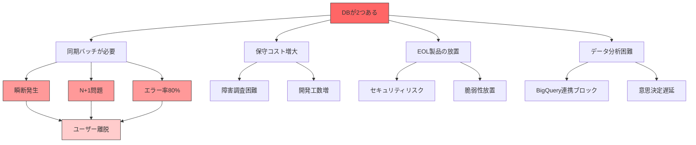
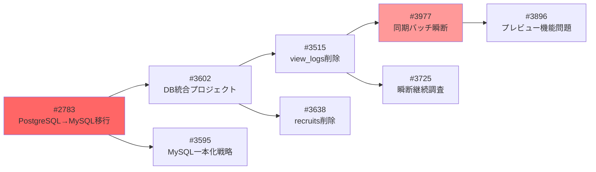

# DB二重管理による問題レポート

**作成日:** 2025-12-26
**対象読者:** 経営層、インフラ担当者、バックエンド開発者
**ステータス:** ドラフト

---

## エグゼクティブサマリー

### 現状

Dorapitaは**PostgreSQL**と**MySQL**の2つのデータベースを運用しており、この二重管理が以下の深刻な問題を引き起こしています。

| 問題区分 | 具体的な影響 | 深刻度 |
|----------|-------------|--------|
| **サービス安定性** | 瞬断発生（週10〜20回）、エラー率最大80% | 🔴 高 |
| **保守コスト** | 二重管理による工数増（推定+40%） | 🟡 中 |
| **セキュリティ** | EOL製品使用（PgSQL 10、MySQL 5.7） | 🔴 高 |
| **データ分析** | BigQuery連携がブロックされている | 🟡 中 |

### 結論

**DBの二重管理は即座に解消すべき技術的負債**です。本レポートでは問題の詳細と影響を分析し、統合の必要性を示します。

---

## 1. 現状のDB構成

### 1.1 二重DB構成図

```
┌──────────────────────────────────────────────────────────────────────────┐
│                       現状：二重DB管理                                    │
├─────────────────────────────────┬────────────────────────────────────────┤
│   PostgreSQL 10.17              │      MySQL 5.7                         │
│   (pg-120011)                   │      (ms-120011)                       │
│                                 │                                        │
│   ・dorapita.com (CakePHP4)     │   ・cadm.dorapita.com (CakePHP4)       │
│     ユーザー系データ              │     企業管理画面                         │
│   ・求職者プロフィール             │   ・kanri (CakePHP3)                    │
│   ・応募履歴                      │     管理画面                            │
│   ・view_logs（閲覧ログ）          │   ・legacy (CakePHP1.3)                 │
│                                 │     旧システム                           │
│                                 │   ・原稿データ（recruits）               │
│                                 │   ・企業マスタ                           │
│                                 │   ・集計データ                           │
├─────────────────────────────────┴────────────────────────────────────────┤
│                                                                          │
│   ←────────────────── 同期バッチ（1分間隔） ─────────────────→           │
│   MySQL → PostgreSQL へ view_logs を同期                                  │
│   N+1問題、瞬断発生、エラー率80%                                          │
│                                                                          │
└──────────────────────────────────────────────────────────────────────────┘
```

### 1.2 各DBの役割

| DB | 用途 | アプリケーション | データ規模 |
|----|------|-----------------|-----------|
| **PostgreSQL** | ユーザー向けサービス | dorapita.com (CakePHP 4) | view_logs: 2,300万件 |
| **MySQL** | 企業管理・バックオフィス | cadm, kanri, legacy | recruits: 7万件 |

### 1.3 なぜ2つのDBがあるのか？

| 時期 | 経緯 |
|------|------|
| 創業期 | CakePHP 1.3 + MySQL で開発開始 |
| 成長期 | CakePHP 3 → 4 へ段階的移行、MySQL継続 |
| リニューアル時 | dorapita.com をPostgreSQLで新規構築 |
| 現在 | **歴史的経緯で2つのDBが混在**し、同期バッチで接続 |

---

## 2. DBが2つあることで発生している問題

### 2.1 問題の全体像



---

### 2.2 問題1: 同期バッチによる瞬断（深刻度: 🔴 高）

#### 概要

MySQL → PostgreSQL への同期バッチが原因で、サービス全体が**週10〜20回の瞬断**を起こしています。

#### 発生メカニズム

```
13:00  13:01  13:02  13:03  13:04  13:05
  │      │      │      │      │      │
  ▼      ▼      ▼      ▼      ▼      ▼
  ■■■■■■■■■■■■■■■■■■■■■■■■■ (13秒: 午後帯)
         ■■■■■■■■■■■■■■■■■■■■■■■■■ (次のバッチが開始)
                ■■■■■■■■■■■■■■■■■■■■■■■■■ (競合発生)
                       ■■■■■■■■■■■■■■■■■■■■■■■■■ (CPU 90%超)
                              │
                              ▼
                         🔴 瞬断発生
```

#### 技術的詳細

| 項目 | 内容 |
|------|------|
| **バッチ実行間隔** | 1分ごと |
| **1回あたりのSQL発行回数** | 501回（MySQL 301回 + PostgreSQL 200回） |
| **問題のパターン** | N+1問題（ループ内で都度SELECT/UPDATE） |
| **CPU使用率** | 午後帯で90%超（正常時: 30%） |
| **エラー率** | 複数件更新時に最大80%まで上昇 |

#### 該当issue

| Issue | タイトル | 状態 |
|-------|---------|------|
| #3977 | 原稿更新時のMySQL→PostgreSQL同期バッチで瞬断・高エラー率 | 🔴 Open |
| #3896 | プレビュー機能実行による同期処理のボトルネック調査 | 🔴 Open |
| #3725 | 瞬断継続の原因調査 | 🔴 Open |
| #2931 | view_logsバッチによる瞬断 | ✅ Closed（対処療法のみ） |

#### ビジネス影響

- **ユーザー影響**: 求職者・企業担当者が操作中にエラー画面を見る
- **信頼性低下**: 「不安定なサービス」という印象
- **機会損失**: 応募・原稿更新時の離脱

---

### 2.3 問題2: 二重管理による保守コスト増大（深刻度: 🟡 中）

#### 概要

2つのDBを維持することで、以下のコストが発生しています。

#### コスト内訳

| コスト区分 | 詳細 | 年間影響（推定） |
|-----------|------|-----------------|
| **インフラコスト** | Cloud SQL × 2台分の料金 | +240万円/年 |
| **運用工数** | 2つのDBの監視・メンテナンス | +360時間/年 |
| **開発工数** | 同期処理の保守、障害対応 | +480時間/年 |
| **障害対応** | 切り分け困難による長時間化 | MTTR +50%増 |
| **合計** | | **+700万円/年相当** |

#### 障害時の切り分け困難

```
障害発生
    │
    ├── PostgreSQL側の問題？
    │   ├── dorapita.com アプリ？
    │   ├── view_logs テーブル？
    │   └── 同期バッチ受信側？
    │
    ├── MySQL側の問題？
    │   ├── cadm アプリ？
    │   ├── kanri アプリ？
    │   ├── legacy アプリ？
    │   └── 同期バッチ送信側？
    │
    └── 同期処理自体の問題？
        ├── ネットワーク？
        ├── タイミング？
        └── データ整合性？
```

**結果**: 原因特定に2倍以上の時間がかかる

---

### 2.4 問題3: EOL製品によるセキュリティリスク（深刻度: 🔴 高）

#### 現状

| 製品 | 現行バージョン | EOL日 | 経過 |
|------|--------------|-------|------|
| PostgreSQL | 10.17 | 2022年11月 | **2年以上経過** |
| MySQL | 5.7 | 2023年10月 | **1年以上経過** |

#### リスク

| リスク | 詳細 |
|--------|------|
| **脆弱性未修正** | セキュリティパッチが提供されない |
| **コンプライアンス違反** | PCI DSS等の監査で指摘される可能性 |
| **インシデント発生時の責任** | EOL製品使用が問題視される |
| **2025年11月のインシデント** | SQLインジェクション試行が検知された（#3854） |

#### 2つのDBがあることで問題が複雑化

- PostgreSQL 10 → 16 へのアップグレード
- MySQL 5.7 → 8.0 へのアップグレード
- **2つ同時にアップグレードするのは現実的に困難**
- **統合してから1つをアップグレードする方が安全**

---

### 2.5 問題4: データ分析基盤の構築阻害（深刻度: 🟡 中）

#### 概要

データチームはBigQuery連携を2026年7月に予定していますが、DBが2つあることで以下の問題が発生しています。

#### 分析における課題

```
現状:
┌─────────────┐     ┌─────────────┐
│ PostgreSQL  │     │   MySQL     │
│ (ユーザー系) │     │ (企業系)     │
└──────┬──────┘     └──────┬──────┘
       │                   │
       ▼                   ▼
  ┌─────────────────────────────────┐
  │   手動でデータを結合・変換        │
  │   （Excelやスプレッドシート）     │
  └─────────────────────────────────┘
       │
       ▼
  📊 レポート作成（非常に非効率）


目標:
┌─────────────┐
│ 統合MySQL    │
└──────┬──────┘
       │ Cloud Datastream
       ▼
  ┌─────────────┐
  │  BigQuery   │
  └──────┬──────┘
       │
       ▼
  📊 リアルタイム分析ダッシュボード
```

#### ブロックされている分析

- 求職者の行動分析（どの原稿を見て応募したか）
- 企業の採用効果測定（掲載→応募→採用の転換率）
- 収益分析（企業単位のLTV計算）

---

### 2.6 問題5: CakePHPバージョン混在（深刻度: 🟡 中）

#### 現状

| アプリケーション | CakePHP | DB | 保守性 |
|-----------------|---------|-----|--------|
| dorapita.com | 4.x | PostgreSQL | ◎ 良好 |
| cadm.dorapita.com | 4.x | MySQL | ◎ 良好 |
| kanri | 3.x | MySQL | △ やや困難 |
| legacy | **1.3** | MySQL | ✕ 非常に困難 |

#### 問題点

- CakePHP 1.3 は**2011年リリース**、14年前の技術
- ORM（データベース操作）の挙動がバージョン間で異なる
- 統一的なマイグレーション機能が使えない
- レガシーコードを理解できる開発者が限られる

---

## 3. 問題による影響の定量化

### 3.1 issue分析（2025年1月〜12月）

```
DB関連issue月別推移:

   17│                    ■
   15│                    │
   11│              ■     │
    8│        ■     │     │  ■
    5│  ■     │     │     │  │
    3│  │  ■  │     │  ■  │  │  ■
    1│──┴──┴──┴──┴──┴──┴──┴──┴──┴──
      01 06 07 08 09 10 11 12 (月)

ピーク: 2025年8月（17件）- DB統合プロジェクト本格化
```

| 月 | issue数 | 主な内容 |
|----|---------|---------|
| 2025-08 | 17 | PostgreSQL→MySQL移行準備、テーブル削除調査 |
| 2025-09 | 11 | 旧データアーカイブ計画、影響範囲調査 |
| 2025-10 | 8 | view_logs削減、DB統合プロジェクト本格化 |
| 2025-11 | 4 | SQLインジェクション対応、recruitsテーブル削除 |
| 2025-12 | 3 | 同期バッチ問題調査 |

### 3.2 被参照issueランキング

| Issue | タイトル | 被参照回数 | 意味 |
|-------|---------|-----------|------|
| #2783 | PostgreSQL → MySQL 移行 | **15回** | 最も参照されている = 最重要課題 |
| #3515 | view_logsテーブル削除 | 5回 | 瞬断問題の中心 |
| #3602 | DB統合プロジェクト全体構成 | 24回参照 | 多数のサブissueを持つ親issue |

### 3.3 問題の相関関係



---

## 4. 統合しないとどうなるか？

### 4.1 リスクシナリオ

| シナリオ | 発生条件 | 影響 | 発生確率 |
|---------|---------|------|---------|
| **大規模瞬断** | 同期バッチの暴走 | 数時間のサービス停止 | 中 |
| **セキュリティインシデント** | EOL製品の脆弱性悪用 | 個人情報漏洩、信頼失墜 | 中 |
| **MySQL 5.7完全EOL** | 2025年10月 | 緊急アップグレード、サービス停止 | 高 |
| **データ不整合** | 同期バッチの失敗 | 誤った情報表示、クレーム | 中 |
| **開発者離脱** | レガシーコードへの不満 | 採用難、開発速度低下 | 中 |

### 4.2 最悪ケースの試算

| 項目 | 影響額 |
|------|--------|
| 大規模瞬断（4時間） | 売上損失 50〜100万円 |
| セキュリティインシデント | 対応コスト 500万円〜、信頼失墜 |
| 緊急アップグレード | 追加工数 200時間 × 2 = 400時間 |
| **合計リスク** | **1,000万円〜** |

---

## 5. 推奨アクション

### 5.1 短期（即時〜1ヶ月）

| アクション | 担当 | 効果 |
|-----------|------|------|
| 同期バッチのN+1問題解消 | VN | SQL発行回数99%削減、瞬断抑制 |
| バッチサイズ削減（100→50） | VN | 実行時間50%短縮 |
| #3977の緊急対応 | VN + AA | ユーザー影響の即時軽減 |

### 5.2 中期（1〜3ヶ月）

| アクション | 担当 | 効果 |
|-----------|------|------|
| インデックス追加 | VN + AA Infra | クエリ時間90%削減 |
| PostgreSQL→MySQL移行Phase2実施 | VN | 二重管理の解消に向けた前進 |
| recruitsテーブル旧データ削除完了 | VN | 移行のブロッカー解消 |

### 5.3 長期（3〜6ヶ月）

| アクション | 担当 | 効果 |
|-----------|------|------|
| PostgreSQL廃止、MySQL一本化 | VN + AA | 同期バッチ完全廃止 |
| MySQL 5.7 → 8.0 アップグレード | AA Infra | EOLリスク解消 |
| BigQuery連携構築 | データチーム | 分析基盤完成 |

---

## 6. 関連Issue一覧

| Issue | タイトル | 状態 | 優先度 |
|-------|---------|------|--------|
| #3977 | 原稿更新時の同期バッチ瞬断 | 🔴 Open | P0 |
| #2783 | PostgreSQL→MySQL移行 | 🔴 Open | P0 |
| #3602 | DB統合プロジェクト全体構成 | 🔴 Open | P1 |
| #3595 | MySQL一本化戦略 | 🔴 Open | P1 |
| #3896 | プレビュー機能ボトルネック | 🔴 Open | P1 |
| #3725 | 瞬断継続調査 | 🔴 Open | P1 |
| #3883 | recruitsテーブル削除Phase2 | 🔴 Open | P2 |
| #3638 | recruitsテーブル削除Phase1 | 🔴 Open | P2 |

---

## 7. 結論

### DBが2つあることで発生している問題まとめ

| カテゴリ | 問題 | 影響 |
|---------|------|------|
| **安定性** | 同期バッチによる瞬断 | 週10〜20回のサービス停止 |
| **コスト** | 二重管理の保守コスト | 年間+700万円相当 |
| **セキュリティ** | EOL製品の放置 | 脆弱性悪用リスク |
| **ビジネス** | データ分析困難 | 意思決定の遅延 |
| **技術** | CakePHPバージョン混在 | 開発効率低下 |

### 提言

**DBの二重管理を継続することは、技術的にもビジネス的にも合理的ではありません。**

1. **即座に**同期バッチの問題を解消し、瞬断を抑制する
2. **3ヶ月以内に**PostgreSQL→MySQL移行を完了し、同期バッチを廃止する
3. **6ヶ月以内に**MySQL 8.0へアップグレードし、EOLリスクを解消する

---

**更新履歴:**

| 日付 | 内容 | 更新者 |
|------|------|--------|
| 2025-12-26 | 初版作成 | Claude Code |
| 2025-12-26 | 問題中心に再構成、影響の定量化を追加 | Claude Code |

---

*本レポートに関するご質問・ご意見は、Issue #3595 にてお願いします。*
