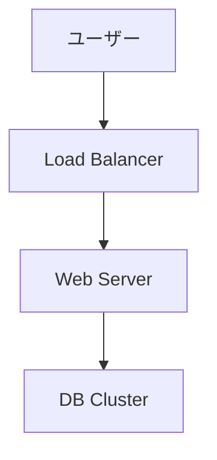

# Gemini CLI 実践ガイド: 大規模プロジェクトの設計パターン

**最終更新**: 2026-01-07

---

## 目次

1. [はじめに](#1-はじめに)
2. [初期セットアップ: プロジェクト構成の基本設計](#2-初期セットアップ-プロジェクト構成の基本設計)
3. [ラッパースクリプトによる標準化](#3-ラッパースクリプトによる標準化)
4. [データ分析基盤の設計パターン](#4-データ分析基盤の設計パターン)
5. [ドキュメント駆動調査の実践](#5-ドキュメント駆動調査の実践)
6. [データ分析ワークフロー](#6-データ分析ワークフロー)
7. [応用例とユースケース](#7-応用例とユースケース)
8. [参考資料](#8-参考資料)

---

## 1. はじめに

### 対象読者

- Gemini CLI 初心者〜中級者
- 大規模インフラ調査・ドキュメント作成プロジェクトを担当する方
- 安全で効率的なAI駆動開発環境を構築したい方

### このガイドで学べること

このガイドは、大規模プロジェクトでの実践知見を基に、Gemini CLI での適用パターンを提供します:

1. **初期セットアップ**: `GEMINI.md` と `settings.json` による環境定義
2. **ラッパースクリプト**: git/gh操作の標準化、安全性の向上
3. **データ分析基盤**: SQLite3によるローカルキャッシュ、柔軟な分析環境の構築
4. **ドキュメント駆動**: 大規模調査プロジェクトの設計

---

## 2. 初期セットアップ: プロジェクト構成の基本設計

### 2.1 プロジェクト固有設定 (GEMINI.md)

**配置**: プロジェクトルートの `GEMINI.md`

Gemini CLI はプロジェクトルートの `GEMINI.md` を読み込み、そのプロジェクトのコンテキストやルールを理解します。

#### Tool Usage Priority

```markdown
## Tool Usage Priority

**重要: 専用ラッパーツールを優先的に使用する**

1. **Git操作**: `~/.local/bin/git-wrapper.sh`を使用（`git`コマンドを直接使わない）
2. **GitHub操作**: `~/.local/bin/gh-wrapper.sh`を使用（`gh`コマンドを直接使わない）
```

**ポイント**:
- ラッパースクリプトの使用を明文化し、Gemini に遵守させる
- 安全な操作のみを自動化し、危険な操作はユーザー確認を挟む

#### 言語・振る舞い設定

```markdown
## 共通ルール

### 1. 言語設定
- 常に**日本語**で会話する。
- コミットメッセージ、プルリクエストのタイトルおよび説明も**日本語**で記述する。
```

### 2.2 グローバル設定 (settings.json)

**配置**: `~/.gemini/settings.json`

Gemini CLI の動作モードや許可ツールを定義します。

```json
{
  "general": {
    "previewFeatures": true
  },
  "model": {
    "name": "gemini-3-pro-preview"
  },
  "security": {
    "approvalMode": "auto_edit",
    "folderTrust": {
      "enabled": true
    },
    "blockGitExtensions": true
  },
  "tools": {
      "allowed": ["read_file", "search_file_content", "ls", "glob", "grep"]
  }
}
```

**ポイント**:
- **`approvalMode: "auto_edit"`**: ファイル編集等のツールを自動承認し、開発速度を向上。
- **`tools.allowed`**: 読み取り系ツールを明示的に許可し、確認の手間を省く。
- **安全性**: `run_shell_command` は許可リストから外すことで、シェル実行時の確認を維持。

---

## 3. ラッパースクリプトによる標準化

Claude Code 同様、Gemini CLI でもラッパースクリプトの使用は安全性と効率性の両面で非常に有効です。

### 3.1 git-wrapper.sh / gh-wrapper.sh

これらのスクリプトは、Gemini CLI から呼び出される際も以下のメリットを提供します。

1.  **安全性**: `push` や `reset` などの危険な操作を検知し、警告を表示。
2.  **ログ記録**: AIによる操作履歴をローカルに保存。
3.  **PAT自動処理**: `gh` コマンド認証の簡略化。

※ スクリプトの実装内容は [元のガイド](https://github.com/hashimoto-kazuhiro-aa/tmp_dorapita_inventory_report/blob/main/claude_code_tips.md#3-%E3%83%A9%E3%83%83%E3%83%91%E3%83%BC%E3%82%B9%E3%82%AF%E3%83%AA%E3%83%97%E3%83%88%E3%81%AB%E3%82%88%E3%82%8B%E6%A8%99%E6%BA%96%E5%8C%96) を参照してください。

### 3.2 Gemini CLI での統合

`GEMINI.md` に「推奨ワークフロー」として記述することで、複雑な手順（同期、PR作成）を Gemini に正しく実行させることができます。

**GEMINI.md への記述例**:

```markdown
## 推奨ワークフロー

### 1. リモートと同期する (Sync)
作業開始前やPR作成前に実行してください。
1. `~/.local/bin/git-wrapper.sh status --short` で現状確認。
2. 変更がある場合は `stash` に退避。
3. `git fetch origin` を実行。
4. `main` ブランチなら `pull`、それ以外なら `rebase origin/main`。
5. 退避した変更があれば `stash pop`。
```

ユーザーが「リモートと同期して」と指示した際、Gemini はこの手順を参照して実行します。

---

## 4. データ分析基盤の設計パターン (SQLite3)

Gemini CLI はローカルファイルの読み書きが得意です。SQLite3 を中間データストアとして利用することで、高度な分析が可能になります。

### 4.1 基本戦略

1.  **データ収集**: `gh-wrapper.sh` で GitHub からデータを取得し、JSON/CSV に変換。
2.  **DB化**: 取得データを `sqlite3` コマンドでローカルDB (`issues.db` 等) にインポート。
3.  **分析**: Gemini に SQL クエリを生成・実行させ、結果を考察させる。

### 4.2 Gemini への指示パターン

**指示**: 「Issueを分析して、月別のオープン数を教えて」

**Gemini の動作**:
1. `GEMINI.md` や指示に基づき、`issues.db` の存在を確認。
2. `sqlite3` コマンドを実行。

```bash
sqlite3 issues.db "
SELECT strftime('%Y-%m', created_at) as month,
       COUNT(*) as total
FROM issues
WHERE state = 'open'
GROUP BY month
ORDER BY month DESC
LIMIT 12"
```

3. 出力結果を読み取り、自然言語で回答を作成。

---

## 5. ドキュメント駆動調査

大規模な調査プロジェクトでは、Gemini に「調査用ドキュメント」を作成・更新させる手法が有効です。

### 5.1 レイヤー構造

ディレクトリを分けて情報を整理します。

- `infrastructure/`: インフラ構成、リソース一覧
- `apps/`: アプリケーション構造、デプロイフロー
- `analysis/`: データ分析レポート

### 5.2 Mermaid 図の活用

Gemini は Mermaid 記法の生成に長けています。複雑な依存関係やフローは図解させましょう。

```markdown

```

---

## 6. まとめ

Gemini CLI を大規模プロジェクトで活用するためのポイント:

1.  **設定のコード化**: `GEMINI.md` と `settings.json` で振る舞いを固定する。
2.  **ラッパーの活用**: 生の `git` コマンドではなく、制御されたラッパースクリプトを使わせる。
3.  **ローカルツールの活用**: `sqlite3` や `jq` などを組み合わせ、Gemini を「コマンドのオーケストレーター」として使う。
4.  **ドキュメント中心**: 調査結果を Markdown ファイルとして残し、それをコンテキストとして次の作業を行う。
