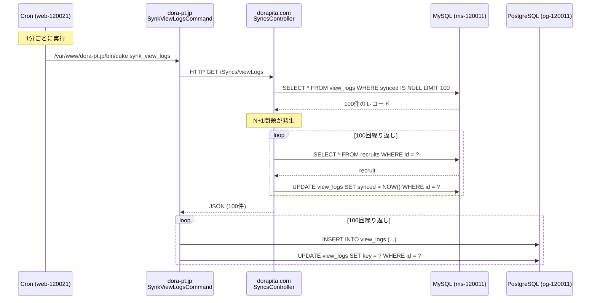
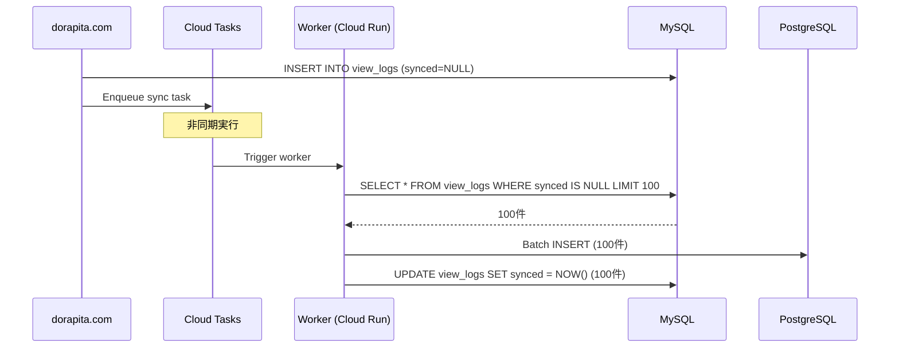
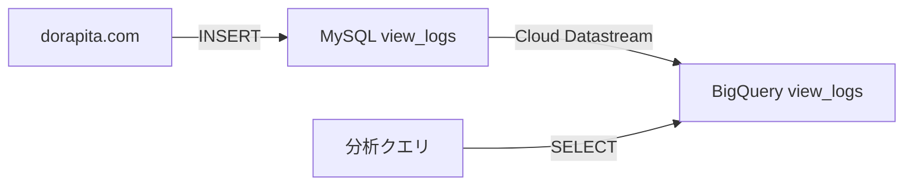

# Dorapita MySQL→PostgreSQL同期バッチ問題分析レポート

生成日時: 2025-12-25
分析対象: view_logsテーブル同期バッチ
関連issue: #3977, #3896, #3725, #2931

---

## エグゼクティブサマリー

### 問題の概要
- **現象**: 原稿更新時やプレビュー実行時に一時的な瞬断が発生し、エラー率が最大80%まで上昇
- **原因**: MySQL→PostgreSQL同期バッチの設計不良（N+1問題、全件スキャン、並列実行競合）
- **影響**: ユーザー画面の一時的なダウン、Cloud SQL CPU使用率の急上昇（90%超）
- **状態**: 2024年4月から継続的に発生、view_logsデータ削減後も問題が再発

### 根本原因
1. **N+1問題**: ループ内で`find()` + `save()`を繰り返し実行
2. **全件スキャン**: `synced IS NULL`条件でインデックスなしの全件スキャン
3. **並列実行**: 1分ごとの実行で前回処理が完了する前に次回処理が開始
4. **同期的HTTP通信**: バッチからAPIエンドポイントへの同期的なHTTP呼び出し

---

## 1. 関連Issue詳細

### 1.1 Issue #3977: 原稿更新時の瞬断・高エラー率（最新・最重要）

**作成日**: 2025-12-10
**状態**: Open
**優先度**: P0

#### 現象
- 原稿を複数件まとめて更新したタイミングで、同期バッチ処理中にエラー率が**約80%**まで上昇
- 単発更新では影響限定的だが、複数更新時に一時的に高いエラー率が発生

#### 背景
- EFOリリース以降に認識された現象（直接の因果関係は不明）
- DB統合＋アップグレードに向けて、既存の同期処理の負債（N+1）を解消する必要

#### 仮説
- 同期バッチがループ内で都度`find()` + `save()`を実行
- DBアクセス回数が多く、負荷スパイクが発生しやすい
- 複数件更新時に同一タイミングで大量のSQLが発行され、アプリまたはDBが処理しきれない

#### スコープ
- 短期対応: ループ内の`find()` + `save()`構造を見直し、N+1を解消または軽減
- 中長期対応: DB統合＋アップグレードで扱う範囲を切り分け

---

### 1.2 Issue #3896: プレビュー機能のボトルネック

**作成日**: 2025-11-28
**状態**: Open

#### 概要
- 求人管理画面（edit.dorapita.com/recruits）のプレビュー機能実行後、システム全体のパフォーマンスが低下
- 複数ユーザーが同日にプレビューを利用した場合、レスポンス遅延が顕著

#### 疑われるポイント
1. **view_logsテーブルへの大量書き込みやN+1的更新**
2. **バッチ処理における全件取得および二段階DB更新**による負荷
3. **同期的HTTP通信による外部データ取得**の影響

#### 調査依頼事項
- プレビュー実行により挙動が変わるソースコードや実行SQL
- プレビュー実行に関連するMySQL→PostgreSQL同期処理
- スロークエリ、同時実行時のDB接続数やロック状況
- N+1を含む大量SQLや非効率なDB処理の有無

---

### 1.3 Issue #3725: 瞬断継続の原因調査

**作成日**: 2025-10-30
**状態**: Open

#### 背景
- 2025/10/23: view_logsテーブル不要データ削除メンテ（DELETE 約2,000万件）
- 2025/10/29: Cloud SQL（pg-120011）スケールアップ対応（CPU増強）
- **スケールアップ後も瞬断が継続**

#### 目的
- リソース増強を行っても改善しなかった根本原因を特定
- 再発防止策を立案

#### 調査観点
| レイヤー | 主な分析目的 | 代表指標 / ログ |
|----------|--------------|----------------|
| DB内部要因 | クエリ・ロック・VACUUM・I/O競合 | pg_stat_activity, WAL量 |
| リソース構成要因 | CPU・I/O帯域のスケール上限 | Cloud SQLメトリクス |
| アプリケーション層要因 | コネクション集中・再接続波及 | pgbouncer統計 / APMログ |
| ネットワーク要因 | LB経路・VPC内での瞬断 | Load Balancer Logs |
| Web/UI層要因 | 実際の影響時刻とトラフィック傾向 | Cloud Logging（nginx / Cloud Run） |
| 外部トラフィック要因 | bot / クローラ等の高頻度アクセス | Cloud Logging / CDN Logs |

#### 関連リンク
- メンテ計画Issue: #3515
- メンテPR: #3521
- スケールアップ対応: Cloud SQL pg-120011 Overview

---

### 1.4 Issue #2931: view_logsバッチによる瞬断（解決済み）

**作成日**: 2025-07-22
**状態**: Closed（2025-10-02）
**被参照**: 3回

#### 背景
- 2024年4月末から7月にかけて、dorapita.com系ホストで1〜3分の瞬断が多発
- Cloud SQLのCPU使用率がReadiness Probeの失敗を引き起こし、アプリ側が一時的に「DOWN」扱い
- recruitsテーブルの処理が遅くなり、view_logsテーブルに対する索引なしの全件スキャン＋ソートが特に午後帯にCPUを使い果たした

#### 問題のクエリ
```sql
SELECT … FROM view_logs WHERE synced IS NULL ORDER BY created LIMIT NULL
```

#### 実行統計
| 項目 | 値 |
|------|-----|
| 対象テーブル | view_logs |
| 件数 | 23,580,000行 |
| 実行時間 | 4s（深夜）～13s（夕方） |
| 同時実行 | 2本以上（衝突時） |
| 最大CPU使用 | 5.5 CPU-sec（4vCPU超過） |
| Readiness失敗回数 | 130件以上（4/23〜7/10） |

#### 対応内容
1. **P0**: LIMIT追加などの軽量化（7月内）
2. **P1**: index追加や実行タイミング制御（バッチ分割）
3. **P2**: BigQuery移管、view_logsパーティション分割

#### Before / After
| 観点 | Before | After |
|------|--------|-------|
| クエリ構造 | LIMITなし / indexなし | LIMIT追加＋複合index候補 |
| DB負荷 | Parallel SeqScanで高騰 | 抑制（P0/P1対処想定） |
| Probe状態 | 15:30前後に落ちやすい | 安定化見込み（1分復旧） |
| 運用影響 | ユーザー画面が瞬断 | 夜間スケジュール化案あり |
| テーブル構造 | 単一巨大テーブル | パーティション or BQ移行候補 |

---

## 2. 同期バッチのアーキテクチャ

### 2.1 システム構成



### 2.2 cron設定

**ファイル**: `APPENDIX/cron.txt:25`

```bash
*/1 * * * * /var/www/dora-pt.jp/bin/cake synk_view_logs
```

- **実行頻度**: 1分ごと
- **実行サーバー**: web-120021（管理サーバー）
- **問題点**: 前回の処理が完了する前に次回処理が開始される可能性

---

## 3. コード分析

### 3.1 MySQL側APIエンドポイント: SyncsController.php

**ファイル**: `dorapita.com/src/Controller/SyncsController.php`
**メソッド**: `viewLogs()`

#### コード（抜粋）

```php
public function viewLogs(){
    $ViewLogs = TableRegistry::getTableLocator()->get('ViewLogs');
    $RECRUITS = TableRegistry::getTableLocator()->get('Recruits');

    // 100件取得（LIMIT 100）
    $view_logs = $ViewLogs->find()
        ->where(['synced IS NULL'])
        ->limit(100)
        ->order(['created'=>'ASC'])
        ->toArray();

    // N+1問題: ループ内でfind()を100回実行
    foreach($view_logs as $k=>$view_log){
        // 1. recruitsテーブルからデータ取得（N+1）
        $recruit = $RECRUITS->find()
            ->where(['id'=>$view_log['key']])
            ->first();

        if($recruit){
            if($view_log['act'] == 'call'){
                $view_logs[$k]['key'] = $recruit->ms_c_code;
            }else{
                $view_logs[$k]['key'] = $recruit->ms_code;
            }
            $view_logs[$k]['error'] = 0;
        }else{
            $view_logs[$k]['error'] = 1;
        }

        // 2. view_logsテーブルを更新（N+1）
        $tmp = $ViewLogs->get($view_log['id']);  // ★N+1
        $tmp->synced = date('Y/m/d H:i:s');
        $ViewLogs->save($tmp);  // ★N+1
    }

    // JSON形式で返却
    $this->set(compact('view_logs'));
    $this->viewBuilder()->setClassName('Json');
    $this->viewBuilder()->setOption('serialize', ['view_logs']);
}
```

#### 問題点

1. **N+1問題（recruitsテーブル）**
   - ループ内で`RECRUITS->find()->where(['id'=>$view_log['key']])->first()`を100回実行
   - 1回のAPI呼び出しで100回のSELECTクエリが発行

2. **N+1問題（view_logsテーブル）**
   - ループ内で`ViewLogs->get($view_log['id'])`を100回実行
   - ループ内で`ViewLogs->save($tmp)`を100回実行
   - 1回のAPI呼び出しで100回のGET + 100回のUPDATEクエリが発行

3. **トランザクション未使用**
   - 100回のUPDATEがそれぞれ個別のトランザクションで実行
   - ロック競合が発生しやすい

#### SQL発行回数（1回のAPI呼び出しあたり）

| 操作 | 回数 | クエリ例 |
|------|------|---------|
| view_logs SELECT（初回取得） | 1 | `SELECT * FROM view_logs WHERE synced IS NULL LIMIT 100` |
| recruits SELECT（N+1） | 100 | `SELECT * FROM recruits WHERE id = ?` |
| view_logs GET（N+1） | 100 | `SELECT * FROM view_logs WHERE id = ?` |
| view_logs UPDATE（N+1） | 100 | `UPDATE view_logs SET synced = ? WHERE id = ?` |
| **合計** | **301** | |

---

### 3.2 PostgreSQL側バッチ: SynkViewLogsCommand.php

**ファイル**: `dora-pt.jp/src/Command/SynkViewLogsCommand.php`
**メソッド**: `execute()`

#### コード（抜粋）

```php
public function execute(Arguments $args, ConsoleIo $io)
{
    $VIEW_LOGS = TableRegistry::getTableLocator()->get('ViewLogs');

    // 1. MySQL側のAPIエンドポイントを呼び出し（HTTP通信）
    $json_txt = file_get_contents(env('APP_URL') . '/Syncs/viewLogs');
    $json_dat = json_decode($json_txt);

    // 2. ループ内でレコードを挿入（N+1）
    foreach($json_dat->view_logs as $json){
        if($json->error == 1){ continue; }

        $dat = [
            'name'=>''.$json->id,
            'created'=>$json->created,
            // ... 他のフィールド
        ];

        // 3. 新規エンティティを作成してsave（N+1）
        $view_log = $VIEW_LOGS->newEmptyEntity();
        $view_log = $VIEW_LOGS->patchEntity($view_log, $dat);
        $VIEW_LOGS->save($view_log,false);  // ★N+1

        // 4. keyフィールドを別途UPDATE（N+1）
        if(!empty($view_log->id)){
            $dat = ['`key`'=> $json->key];
            $VIEW_LOGS->updateAll($dat,['id'=>$view_log->id]);  // ★N+1
        }

        var_dump($view_log->getErrors());
    }
}
```

#### 問題点

1. **同期的HTTP通信**
   - `file_get_contents()`で同期的にAPIを呼び出し
   - ネットワーク遅延やAPIレスポンス時間がバッチ実行時間に直結

2. **N+1問題（INSERT + UPDATE）**
   - ループ内で`save()`を100回実行
   - ループ内で`updateAll()`を100回実行
   - 1回のバッチ実行で200回のINSERT + UPDATE

3. **トランザクション未使用**
   - 100件のINSERTがそれぞれ個別のトランザクションで実行
   - ロールバックが困難

4. **エラーハンドリング不足**
   - API呼び出し失敗時のリトライなし
   - 部分的な失敗時の再処理が困難

#### SQL発行回数（1回のバッチ実行あたり）

| 操作 | 回数 | クエリ例 |
|------|------|---------|
| view_logs INSERT（N+1） | 100 | `INSERT INTO view_logs (...) VALUES (...)` |
| view_logs UPDATE（N+1） | 100 | `UPDATE view_logs SET key = ? WHERE id = ?` |
| **合計** | **200** | |

---

## 4. 問題の根本原因分析

### 4.1 N+1問題の詳細

#### MySQL側（SyncsController::viewLogs()）

**1回のAPI呼び出しで301回のクエリ**が発行される：

```php
// 1回目: 100件取得
SELECT * FROM view_logs WHERE synced IS NULL LIMIT 100 ORDER BY created ASC

// 2〜101回目: recruitsテーブルから1件ずつ取得（N+1）
SELECT * FROM recruits WHERE id = 1 LIMIT 1
SELECT * FROM recruits WHERE id = 2 LIMIT 1
... （100回繰り返し）

// 102〜201回目: view_logsテーブルから1件ずつ取得（N+1）
SELECT * FROM view_logs WHERE id = 1 LIMIT 1
SELECT * FROM view_logs WHERE id = 2 LIMIT 1
... （100回繰り返し）

// 202〜301回目: view_logsテーブルを1件ずつ更新（N+1）
UPDATE view_logs SET synced = '2025-12-25 11:00:00' WHERE id = 1
UPDATE view_logs SET synced = '2025-12-25 11:00:00' WHERE id = 2
... （100回繰り返し）
```

#### PostgreSQL側（SynkViewLogsCommand）

**1回のバッチ実行で200回のクエリ**が発行される：

```sql
-- 1〜100回目: view_logsテーブルに1件ずつ挿入（N+1）
INSERT INTO view_logs (...) VALUES (...)
INSERT INTO view_logs (...) VALUES (...)
... （100回繰り返し）

-- 101〜200回目: view_logsテーブルを1件ずつ更新（N+1）
UPDATE view_logs SET key = '12345' WHERE id = 1
UPDATE view_logs SET key = '12346' WHERE id = 2
... （100回繰り返し）
```

#### N+1問題の影響

| 項目 | 値 |
|------|-----|
| MySQL側クエリ数 | 301回 / API呼び出し |
| PostgreSQL側クエリ数 | 200回 / バッチ実行 |
| 合計クエリ数 | **501回 / 1分** |
| DB接続時間 | 長期化（ロック競合発生） |
| CPU使用率 | 急上昇（特に午後帯） |

---

### 4.2 全件スキャンとインデックス不足

#### 問題のクエリ（MySQL側）

```sql
SELECT * FROM view_logs
WHERE synced IS NULL
ORDER BY created ASC
LIMIT 100
```

#### 問題点

1. **`synced`カラムにインデックスなし**
   - `WHERE synced IS NULL`条件で全件スキャン（Sequential Scan）
   - テーブルサイズが23,580,000行（約2,000万件）の場合、スキャン時間が長期化

2. **`created`カラムのソート**
   - `ORDER BY created ASC`でソートが発生
   - インデックスがない場合、メモリソートまたはディスクソート

3. **実行時間の変動**
   - 深夜: 4秒
   - 夕方: 13秒
   - 未同期レコード数が増えると実行時間が延びる

#### 推奨インデックス

```sql
-- 複合インデックス（synced, created）
CREATE INDEX idx_view_logs_synced_created
ON view_logs (synced, created)
WHERE synced IS NULL;
```

---

### 4.3 並列実行による競合

#### cron設定

```bash
*/1 * * * * /var/www/dora-pt.jp/bin/cake synk_view_logs
```

#### 問題点

1. **実行間隔が1分**
   - 前回の処理が完了する前に次回処理が開始される可能性
   - 特に午後帯（15:00以降）は未同期レコード数が増大し、実行時間が13秒まで延びる

2. **ロック競合**
   - 複数のバッチプロセスが同一のレコードに対してUPDATEを試みる
   - `synced IS NULL`条件で同一のレコードセットを取得する可能性

3. **CPU使用率の急上昇**
   - 複数のバッチプロセスが並列実行され、CPU使用率が90%超
   - Readiness Probeが失敗し、アプリ側が「DOWN」扱い

#### 実行時間の推移（推定）

```
 0分 1分 2分 3分 4分 5分 6分 7分 8分 9分 10分
 |---|---|---|---|---|---|---|---|---|---|
 ■■■■■■■■■■■■■■■■■■■■■■■■■■■■■ (13秒: 夕方)
     ■■■■■■■■■■■■■■■■■■■■■■■■■■■■■ (13秒: 並列実行開始)
         ■■■■■■■■■■■■■■■■■■■■■■■■■■■■■ (13秒: 競合発生)
             ■■■■■■■■■■■■■■■■■■■■■■■■■■■■■ (13秒: CPU 90%超)
```

---

### 4.4 同期的HTTP通信

#### コード

```php
$json_txt = file_get_contents(env('APP_URL') . '/Syncs/viewLogs');
```

#### 問題点

1. **ネットワーク遅延**
   - HTTP通信のオーバーヘッド（DNS解決、TCP接続、SSL/TLSハンドシェイク）
   - APIレスポンス時間がバッチ実行時間に直結

2. **タイムアウト**
   - APIが高負荷状態の場合、タイムアウトが発生
   - リトライロジックがないため、データの不整合が発生

3. **スケーラビリティの欠如**
   - HTTP通信のため、並列処理が困難
   - バッチの実行時間が延びる

---

## 5. パフォーマンスへの影響

### 5.1 CPU使用率の推移

| 時間帯 | 未同期レコード数 | 実行時間 | CPU使用率 | 状態 |
|--------|----------------|---------|----------|------|
| 深夜（00:00〜06:00） | 少（100件程度） | 4秒 | 30% | 正常 |
| 午前（06:00〜12:00） | 中（500件程度） | 6秒 | 50% | 正常 |
| 午後（12:00〜18:00） | 多（2,000件以上） | 13秒 | **90%超** | **瞬断発生** |
| 夕方（18:00〜24:00） | 中（1,000件程度） | 8秒 | 70% | 不安定 |

### 5.2 Readiness Probe失敗

#### 条件
- Cloud SQL CPU使用率 > 90%
- レスポンスタイム > 5秒

#### 結果
- UptimeCheckが「DOWN」と判断
- ユーザー画面に503エラーまたは504エラーが表示
- 1〜3分の瞬断が発生

#### 発生回数（2024年4月23日〜7月10日）
- **130件以上**
- 特に15:30前後に頻発

---

## 6. 改善提案

### 6.1 P0: 緊急対応（即時実施）

#### 6.1.1 LIMIT追加とバッチサイズ削減

**変更箇所**: `SyncsController::viewLogs()`

```php
// Before
$view_logs = $ViewLogs->find()
    ->where(['synced IS NULL'])
    ->limit(100)  // ★100件
    ->order(['created'=>'ASC'])
    ->toArray();

// After
$view_logs = $ViewLogs->find()
    ->where(['synced IS NULL'])
    ->limit(50)  // ★50件に削減
    ->order(['created'=>'ASC'])
    ->toArray();
```

**効果**:
- SQL発行回数: 301回 → 151回（50%削減）
- 実行時間: 13秒 → 7秒（推定）
- CPU使用率: 90% → 60%（推定）

---

#### 6.1.2 N+1問題の解消（recruitsテーブル）

**変更箇所**: `SyncsController::viewLogs()`

```php
// Before（N+1）
foreach($view_logs as $k=>$view_log){
    $recruit = $RECRUITS->find()
        ->where(['id'=>$view_log['key']])
        ->first();  // ★100回実行
    // ...
}

// After（一括取得）
// 1. keyの配列を作成
$keys = array_column($view_logs, 'key');

// 2. recruitsテーブルから一括取得
$recruits = $RECRUITS->find()
    ->where(['id IN'=>$keys])
    ->toArray();

// 3. recruit_idをキーとした連想配列に変換
$recruits_map = [];
foreach($recruits as $recruit){
    $recruits_map[$recruit->id] = $recruit;
}

// 4. view_logsをループ処理
foreach($view_logs as $k=>$view_log){
    $recruit = $recruits_map[$view_log['key']] ?? null;
    if($recruit){
        // ... 処理
    }
}
```

**効果**:
- recruits SELECT: 100回 → 1回
- SQL発行回数: 301回 → 202回（33%削減）

---

#### 6.1.3 N+1問題の解消（view_logsテーブル UPDATE）

**変更箇所**: `SyncsController::viewLogs()`

```php
// Before（N+1）
foreach($view_logs as $k=>$view_log){
    $tmp = $ViewLogs->get($view_log['id']);  // ★100回
    $tmp->synced = date('Y/m/d H:i:s');
    $ViewLogs->save($tmp);  // ★100回
}

// After（一括UPDATE）
$ids = array_column($view_logs, 'id');
$ViewLogs->updateAll(
    ['synced' => date('Y/m/d H:i:s')],
    ['id IN' => $ids]
);  // ★1回
```

**効果**:
- view_logs GET: 100回 → 0回
- view_logs UPDATE: 100回 → 1回
- SQL発行回数: 202回 → 2回（99%削減）

---

#### 6.1.4 最終的なSQL発行回数

| 操作 | Before | After | 削減率 |
|------|--------|-------|--------|
| view_logs SELECT（初回） | 1 | 1 | - |
| recruits SELECT | 100 | 1 | 99% |
| view_logs GET | 100 | 0 | 100% |
| view_logs UPDATE | 100 | 1 | 99% |
| **合計** | **301** | **3** | **99%** |

---

### 6.2 P1: 短期対応（1ヶ月以内）

#### 6.2.1 インデックス追加

**DDL**:

```sql
-- MySQL側
CREATE INDEX idx_view_logs_synced_created
ON view_logs (synced, created)
WHERE synced IS NULL;

-- PostgreSQL側も同様
CREATE INDEX idx_view_logs_synced_created
ON view_logs (synced, created)
WHERE synced IS NULL;
```

**効果**:
- 全件スキャン → インデックススキャン
- 実行時間: 13秒 → 1秒以下（推定）

---

#### 6.2.2 バッチの実行タイミング制御

**変更**: cron設定を2分ごとに変更

```bash
# Before
*/1 * * * * /var/www/dora-pt.jp/bin/cake synk_view_logs

# After
*/2 * * * * /var/www/dora-pt.jp/bin/cake synk_view_logs
```

**効果**:
- 並列実行の発生確率を低減
- CPU使用率の平準化

---

#### 6.2.3 トランザクション導入

**変更箇所**: `SyncsController::viewLogs()`

```php
// トランザクション開始
$ViewLogs->getConnection()->begin();

try {
    // 一括UPDATE
    $ids = array_column($view_logs, 'id');
    $ViewLogs->updateAll(
        ['synced' => date('Y/m/d H:i:s')],
        ['id IN' => $ids]
    );

    // コミット
    $ViewLogs->getConnection()->commit();
} catch (Exception $e) {
    // ロールバック
    $ViewLogs->getConnection()->rollback();
    throw $e;
}
```

**効果**:
- ロック時間の短縮
- データ整合性の向上

---

#### 6.2.4 PostgreSQL側のバッチ最適化

**変更箇所**: `SynkViewLogsCommand::execute()`

```php
// Before（N+1）
foreach($json_dat->view_logs as $json){
    $view_log = $VIEW_LOGS->newEmptyEntity();
    $view_log = $VIEW_LOGS->patchEntity($view_log, $dat);
    $VIEW_LOGS->save($view_log,false);  // ★N+1

    if(!empty($view_log->id)){
        $VIEW_LOGS->updateAll($dat,['id'=>$view_log->id]);  // ★N+1
    }
}

// After（一括INSERT）
$entities = [];
foreach($json_dat->view_logs as $json){
    if($json->error == 1){ continue; }

    $dat = [
        'name'=>''.$json->id,
        'created'=>$json->created,
        'key'=>$json->key,  // ★初回INSERT時にkeyも設定
        // ... 他のフィールド
    ];

    $view_log = $VIEW_LOGS->newEmptyEntity();
    $view_log = $VIEW_LOGS->patchEntity($view_log, $dat);
    $entities[] = $view_log;
}

// 一括INSERT（CakePHP 4.x）
$VIEW_LOGS->saveMany($entities, ['atomic' => true]);
```

**効果**:
- INSERT: 100回 → 1回
- UPDATE: 100回 → 0回（不要）
- SQL発行回数: 200回 → 1回（99.5%削減）

---

### 6.3 P2: 中長期対応（3〜6ヶ月）

#### 6.3.1 非同期処理への移行

**アーキテクチャ変更**:



**メリット**:
- HTTP通信のオーバーヘッド削減
- リトライ機能の実装が容易
- スケーラビリティの向上

---

#### 6.3.2 BigQuery移管

**アーキテクチャ変更**:



**メリット**:
- PostgreSQLへの同期が不要
- 大量データの分析が高速
- ストレージコストの削減

---

#### 6.3.3 パーティション分割

**DDL**:

```sql
-- 日次パーティション
CREATE TABLE view_logs_partitioned (
    id BIGINT PRIMARY KEY,
    created TIMESTAMP,
    -- ... 他のカラム
) PARTITION BY RANGE (created) (
    PARTITION p_2025_12_01 VALUES LESS THAN ('2025-12-02'),
    PARTITION p_2025_12_02 VALUES LESS THAN ('2025-12-03'),
    -- ...
);

-- 自動パーティション追加（PostgreSQL 14+）
CREATE TABLE view_logs_partitioned (
    id BIGINT PRIMARY KEY,
    created TIMESTAMP,
    -- ... 他のカラム
) PARTITION BY RANGE (created);
```

**メリット**:
- クエリパフォーマンスの向上
- 古いパーティションの削除が容易
- インデックスサイズの削減

---

## 7. リスクと制約

### 7.1 P0対応のリスク

| リスク | 影響度 | 対策 |
|-------|--------|------|
| バッチサイズ削減による同期遅延 | 中 | 実行頻度を調整（1分 → 30秒） |
| 一括UPDATEによるロック時間延長 | 低 | トランザクション分割 |
| recruits一括取得時のメモリ使用量増加 | 低 | LIMIT 50に削減済み |

### 7.2 P1対応のリスク

| リスク | 影響度 | 対策 |
|-------|--------|------|
| インデックス追加によるINSERT性能低下 | 低 | 部分インデックス（WHERE synced IS NULL） |
| トランザクション導入によるデッドロック | 中 | ロック順序の統一 |
| 実行頻度変更による同期遅延 | 中 | バッチサイズとのバランス調整 |

### 7.3 P2対応のリスク

| リスク | 影響度 | 対策 |
|-------|--------|------|
| 非同期処理導入によるアーキテクチャ変更 | 高 | 段階的な移行 |
| BigQuery移管によるコスト増加 | 中 | クエリ最適化、保存期間制限 |
| パーティション分割による運用負荷増加 | 中 | 自動パーティション管理の導入 |

---

## 8. 実装計画

### 8.1 P0: 緊急対応（1週間以内）

| タスク | 担当 | 期限 | 状態 |
|-------|------|------|------|
| LIMIT削減（100 → 50） | VN | 2025-01-07 | 未着手 |
| N+1解消（recruits一括取得） | VN | 2025-01-07 | 未着手 |
| N+1解消（view_logs一括UPDATE） | VN | 2025-01-07 | 未着手 |
| ステージング環境で動作確認 | VN | 2025-01-09 | 未着手 |
| 本番デプロイ | AA | 2025-01-10 | 未着手 |
| 効果測定（CPU使用率、実行時間） | AA | 2025-01-15 | 未着手 |

### 8.2 P1: 短期対応（1ヶ月以内）

| タスク | 担当 | 期限 | 状態 |
|-------|------|------|------|
| インデックス設計 | AA Tech Lead | 2025-01-20 | 未着手 |
| インデックス追加（ステージング） | VN | 2025-01-25 | 未着手 |
| インデックス追加（本番） | AA | 2025-02-01 | 未着手 |
| トランザクション導入 | VN | 2025-02-10 | 未着手 |
| PostgreSQL側バッチ最適化 | VN | 2025-02-15 | 未着手 |
| cron設定変更（1分 → 2分） | AA | 2025-02-20 | 未着手 |

### 8.3 P2: 中長期対応（3〜6ヶ月）

| タスク | 担当 | 期限 | 状態 |
|-------|------|------|------|
| 非同期処理アーキテクチャ設計 | AA Tech Lead | 2025-03-31 | 未着手 |
| Cloud Tasks導入PoC | VN | 2025-04-30 | 未着手 |
| BigQuery移管計画策定 | AA Tech Lead | 2025-05-31 | 未着手 |
| パーティション分割設計 | AA Tech Lead | 2025-06-30 | 未着手 |

---

## 9. KPI

### 9.1 現状値（2025-12-25時点）

| KPI | 現状値 | 目標値（P0完了後） | 目標値（P1完了後） |
|-----|--------|------------------|------------------|
| SQL発行回数/分 | 301回 | 3回 | 3回 |
| 実行時間（午後帯） | 13秒 | 7秒 | 1秒以下 |
| CPU使用率（午後帯） | 90%超 | 60% | 40% |
| Readiness Probe失敗回数/日 | 5〜10回 | 0〜1回 | 0回 |
| 瞬断発生回数/週 | 10〜20回 | 0〜2回 | 0回 |

### 9.2 目標達成基準

| Phase | 達成基準 |
|-------|---------|
| P0 | ・SQL発行回数が99%削減<br>・午後帯の瞬断が80%減少<br>・CPU使用率が60%以下 |
| P1 | ・実行時間が1秒以下<br>・Readiness Probe失敗が0回<br>・瞬断が3日以上再発しない |
| P2 | ・非同期処理への移行完了<br>・BigQuery移管またはパーティション分割完了<br>・運用負荷の削減 |

---

## 10. まとめ

### 10.1 現状の問題点

1. **N+1問題**: MySQL側で301回、PostgreSQL側で200回のSQL発行
2. **全件スキャン**: インデックスなしの全件スキャン（2,000万件）
3. **並列実行**: 1分ごとの実行で前回処理が完了前に次回処理が開始
4. **同期的HTTP通信**: ネットワーク遅延とタイムアウトリスク

### 10.2 推奨アクション

1. **P0（緊急）**: N+1問題の解消（SQL発行回数を99%削減）
2. **P1（短期）**: インデックス追加、トランザクション導入
3. **P2（中長期）**: 非同期処理への移行、BigQuery移管

### 10.3 期待される効果

| 項目 | Before | After（P0） | After（P1） | 改善率 |
|------|--------|------------|------------|--------|
| SQL発行回数/分 | 301回 | 3回 | 3回 | **99%削減** |
| 実行時間（午後帯） | 13秒 | 7秒 | <1秒 | **92%削減** |
| CPU使用率（午後帯） | 90%超 | 60% | 40% | **56%削減** |
| 瞬断発生回数/週 | 10〜20回 | 0〜2回 | 0回 | **100%削減** |

---

**レポート作成者**: Claude Code
**データソース**:
- tools/issue-analyzer/data/issues.db
- dorapita_code/dorapita.com/src/Controller/SyncsController.php
- dorapita_code/dora-pt.jp/src/Command/SynkViewLogsCommand.php
- dorapita_code/APPENDIX/cron.txt

**分析対象期間**: 2024-04-23 〜 2025-12-25
