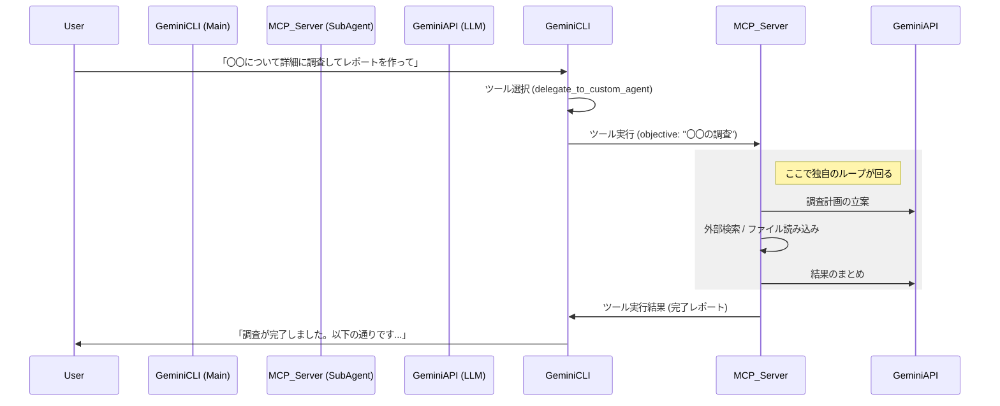

# Gemini CLI における Sub Agents 実装分析レポート

## 1. 概要
Claude Code の Sub Agents は、メインのエージェントが解決困難なタスクや、特定の専門知識が必要なタスク（例: 大規模なコード調査、テスト修正）を、別のシステムプロンプトとツールセットを持つ「サブエージェント」に丸投げする仕組みです。

Gemini CLI においても、アーキテクチャ上は同様の **「Tool Use（ツール利用）による再帰的エージェント呼び出し」** によって実現されています。

## 2. 現状のアーキテクチャ分析
提供されたファイルリストに基づくと、Gemini CLI (`@google/gemini-cli-core`) はすでにこの機能をネイティブにサポートしています。

### キーとなるコンポーネント
以下のファイル群が Sub Agent 機能の中核を担っています。

1.  **委譲用ツール (`DelegateToAgentTool`)**
    *   `src/agents/delegate-to-agent-tool.js`
    *   メインエージェントから見える「窓口」です。LLM がこのツールを呼ぶことで、サブエージェントが起動します。

2.  **エージェントレジストリ (`AgentRegistry`)**
    *   `src/agents/registry.js`
    *   利用可能なサブエージェント（`codebase_investigator` 等）を管理・検索する仕組みです。

3.  **サブエージェントの実装 (`CodebaseInvestigator`)**
    *   `src/agents/codebase-investigator.js`
    *   実際のサブエージェントのロジックです。独自のシステムプロンプト（「あなたはコードベース調査の専門家です...」等）と、許可されたツールセットを持ちます。

4.  **Model Context Protocol (MCP)**
    *   `src/mcp/` 配下
    *   外部の機能をエージェントとして取り込むための標準プロトコルです。

---

## 3. Sub Agent の作り方（実装パターン）

Gemini CLI で独自の Sub Agent を作るには、大きく分けて2つのアプローチがあります。

### パターンA: ネイティブ拡張（CLI自体の改造）
現在の `codebase_investigator` と同じように、CLI のコアロジックに組み込む方法です。

#### 実装ステップ
1.  **エージェントクラスの作成**:
    *   特定の目的（例: `DatabaseAdmin`）に特化したクラスを作成します。
    *   専用の `System Instruction` を定義します（例: 「あなたは安全にSQLを発行する管理者です。破壊的な操作は禁止されています」）。
    *   使用可能なツールを制限・定義します。

2.  **実行ループの分離**:
    *   メインのチャットループとは別に、サブエージェント用の対話ループ（Turn Loop）を持たせます。
    *   メインエージェントからの入力を「ユーザープロンプト」として受け取り、タスク完了後に「最終回答」を返します。

3.  **ツールとしての登録**:
    *   `delegate_to_agent` ツールの引数（`agent_name`）として、新しいエージェント名を認識できるようにします。

**疑似コード例:**
```javascript
// MySubAgent.js
class MySubAgent {
  constructor(context) {
    this.systemPrompt = "あなたは〇〇の専門家です。以下のツールのみを使用してください...";
    this.tools = [/* 専用ツール */];
  }

  async run(objective) {
    // 独立したチャットセッションを開始
    const session = new ChatSession(this.systemPrompt, this.tools);
    const result = await session.sendMessage(objective);
    return result.text; // メインエージェントへの戻り値
  }
}
```

### パターンB: MCP (Model Context Protocol) サーバーとしての実装（推奨）
Gemini CLI は MCP をサポートしているため、**外部プロセスとしてサブエージェントを作成し、それをツールとして接続する**のが最も現代的で安全な方法です。これなら CLI のソースコードを書き換える必要がありません。

#### 実装ステップ
1.  **MCPサーバーの作成**:
    *   Node.js や Python で MCP サーバーを立ち上げます。
    *   このサーバーが `perform_complex_task` (例) というツールを公開します。

2.  **内部でのエージェントループ**:
    *   そのツールが呼ばれたら、MCPサーバー内部で**別の LLM API (Gemini API等)** を叩き、自律的に思考・行動させます。
    *   結果が出たら、ツールの実行結果として Gemini CLI に返します。

3.  **設定ファイルへの追加**:
    *   `~/.gemini/mcp_config.json` (または `settings.json`) に自作の MCP サーバーを登録します。

---

## 4. Claude Code との比較・実現可能性

| 特徴 | Claude Code | Gemini CLI | 実現方法 |
| :--- | :--- | :--- | :--- |
| **呼び出し方法** | Tool Use (`Delegate`) | Tool Use (`delegate_to_agent`) | 実装済み。同じパターンで利用可能。 |
| **コンテキスト** | 分離される (履歴を持たない) | 分離可能 | エージェントクラス生成時に `history` を引き継ぐか、空にするかで制御可能。 |
| **ツール制限** | サブエージェントごとに定義 | 定義可能 | エージェントインスタンスに渡す `tools` 配列で制御。 |
| **拡張性** | 公式実装待ち / プラグイン | **MCP + Core** | **MCP** を使えば、ユーザーレベルで無限にサブエージェントを追加可能。 |

## 5. 推奨アクション

あなたが「Gemini CLI で Sub Agents を利用したい」場合、以下の手順が最も近道です。

1.  **既存機能の活用**:
    *   すでに `codebase_investigator` が利用可能です。複雑なコード解析を依頼するときは、「コードベースを調査して〜」と依頼すると、内部的に `delegate_to_agent` が呼ばれるはずです。

2.  **独自のサブエージェント作成 (MCP)**:
    *   特定の定型業務（例：PRレビュー、SQL生成、特定ライブラリの実装）を行うサブエージェントが欲しい場合、**MCP サーバーを作成し、その中でエージェントループを回す** 実装を行ってください。
    *   Gemini CLI はそれを「強力なツール」として認識し、必要に応じて委譲するようになります。

### サンプル: MCPによるサブエージェント化の概念図


